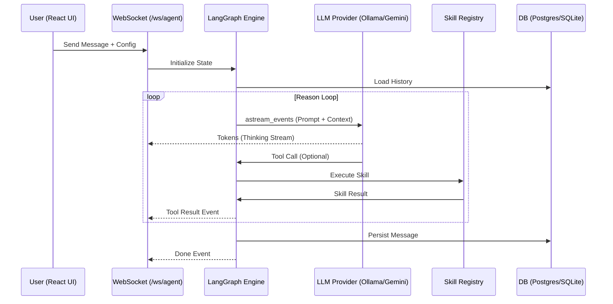

# AICodex Architecture Overview

AICodex is an agentic coding environment built on a modular, event-driven architecture.

## 🏗️ The Three Pillars

### 1. The Reasoning Engine (LangGraph)
The core of AICodex is a **LangGraph** state machine. 
- **Reasoning Node**: Invokes the selected LLM provider to plan the next move.
- **Execution Node**: Dispatches tool calls to the Skill Registry.
- **State**: Persisted across turns, including message history, retrieved context, and tool results.

### 2. The Skill Registry (Sandbox)
A secure execution environment for the agent.
- **Built-in Skills**: File reading, shell execution, RAG queries, and GitHub integration.
- **Sandboxed Execution**: Shell commands run in a restricted subprocess with operator blocking (`;`, `&&`, etc.) and a command allowlist.
- **MCP Compatibility**: Designed to interface with Model Context Protocol servers for extensible toolsets.

### 3. The Real-time Portal (FastAPI + React)
A glassmorphic interface connected via persistent WebSockets.
- **Streaming Pipeline**: `astream_events` (v2) feeds granular tokens, tool calls, and node transitions directly to the UI.
- **Telemetry**: Hardware metrics (NPU/GPU/RAM) are streamed in parallel via a dedicated `/ws/metrics` channel.
- **Design System**: Built on TailwindCSS v4 with Framer Motion animations and p5.js generative backgrounds.

---

## 🔄 Data Flow

---

## 📁 Repository Structure

- `backend/`: FastAPI application, LangGraph agent, and Skill system.
- `client/`: React/Vite/Tailwind frontend.
- `mcp/`: TypeScript-based MCP server prototypes.
- `docs/`: Technical documentation and implementation logs.
- `data/`: Local storage for SQLite and session profiles.

---

## 🛡️ Security Model

- **JWT Authentication**: Required for all REST and WebSocket communication.
- **Secret Management**: All sensitive keys are passed from the client per-request or stored in `.env` (never hardcoded).
- **Sandbox Isolation**: Prevents destructive shell operations via command allowlisting and operator sanitization.
- **Resource Limits**: Configurable timeouts and recursion limits prevent runaway agent processes.
