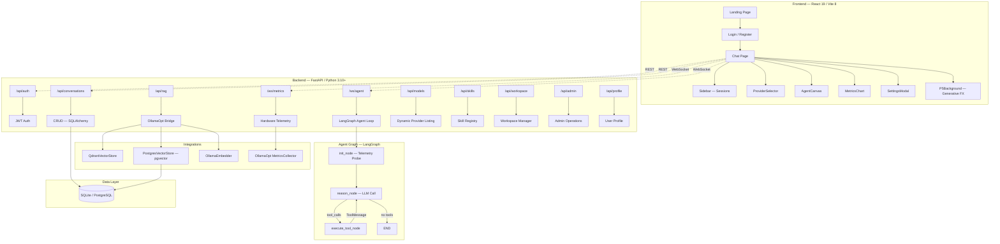
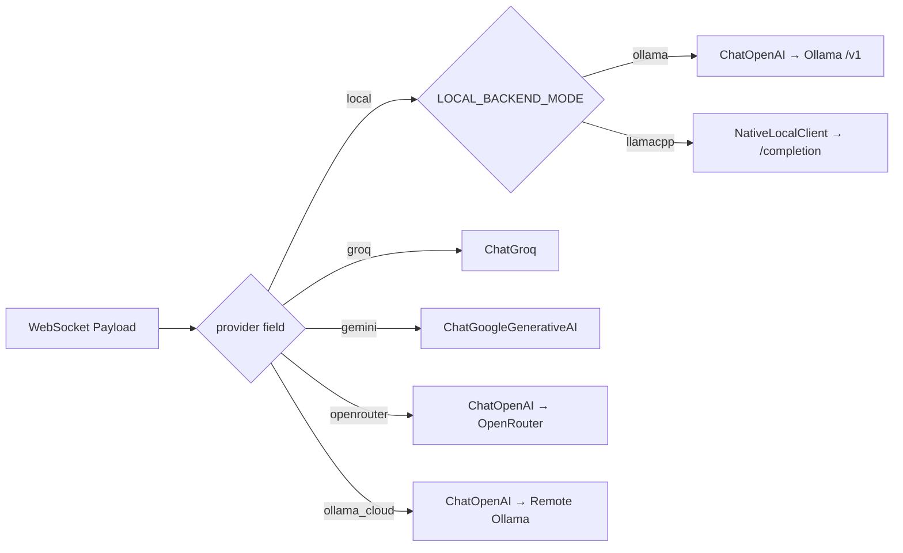
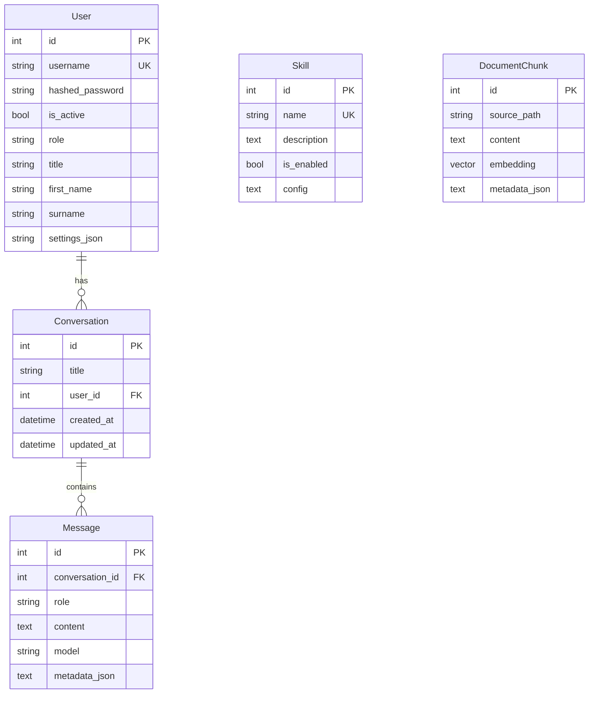

# AICodex — System Architecture Document

> **Project**: AdaptivIntelligenceCodex (AICodex)  
> **Author**: Thabang Mposula  
> **Version**: 0.1.0 | **Document Rev**: 1.0  
> **Date**: 2026-05-09  
> **Repository**: `github.com/iarxii/AI_Codex`

---

## 1. Executive Summary

AICodex is an **agentic AI coding harness** — a full-stack web application that pairs a **FastAPI + LangGraph** backend with a **React 19 / Vite 8 / TailwindCSS v4** frontend. It enables real-time agentic reasoning over persistent WebSocket connections, supporting **5 LLM providers** (Local Ollama, Local llama.cpp, Groq, Gemini, OpenRouter), RAG-grounded code search, sandboxed shell execution, and a modular skill plugin system.

### Core Value Proposition

| Capability | Description |
|:-----------|:------------|
| **Multi-Provider LLM Routing** | Per-message provider/model switching via WebSocket payload |
| **Dual Local LLM Backend** | Toggle between Ollama App (auto-template) and raw llama-server (manual templates) |
| **Agentic Skill System** | Auto-discovered plugin skills with sandboxed execution |
| **RAG Pipeline** | Vector search via pgvector/Qdrant with [OllamaOpt](https://github.com/iarxii/OllamaOpt) bridge |
| **Graphify Knowledge Graph** | Per-workspace and global structural codebase mapping |
| **Real-Time Telemetry** | Hardware metrics (NPU/GPU/CPU/RAM) streamed via dedicated WebSocket |
| **BYOK Architecture** | Bring Your Own Key — users supply their own API keys per provider |
| **Cloud Run Production** | GCS-synced SQLite persistence for serverless deployment |

---

## 2. High-Level Architecture



---

## 3. The Three Pillars

### 3.1 The Reasoning Engine (LangGraph)

The core is a **LangGraph StateGraph** with three nodes:

```
Entry → [init_node] → [reason_node] ──tool_calls──→ [execute_tool_node] ──→ [reason_node]
                                      ╰──no tools──→ END
```

**AgentState** carries:
- `messages` — Conversation history (LangChain `add_messages` reducer)
- `current_tool_calls` — Active tool invocations for UI rendering
- `context_data` — RAG/memory context from [OllamaOpt](https://github.com/iarxii/OllamaOpt)
- `routing_decision` — Hardware routing info (NPU/GPU/CPU)
- `telemetry` — Model capabilities, latencies, token usage
- `error` — Error state

**Key Behaviors:**
- **Dynamic LLM Selection**: `get_dynamic_llm()` selects provider per-request via `RunnableConfig`
- **Context Budgeting**: History summarization at >15 messages via cloud LLM
- **Workspace Sentinel**: Persistent `workspace_status.md` updated every 5 turns
- **Performance Logging**: Every LLM call and tool execution logged with duration

### 3.2 The Skill Registry (Sandbox)

Skills are the agent's "hands" — auto-discovered plugins inheriting from `BaseSkill`:

| Skill | Description | Safety |
|:------|:------------|:-------|
| `shell_exec` | Runs allowlisted CLI commands | Sandboxed |
| `workspace_reader` | Reads/lists/searches files | Local FS |
| `workspace_writer` | Creates/writes workspace files | Local FS |
| `rag_query` | Semantic search over project | Vector Store |
| `url_reader` | Fetches and cleans web content | External |
| `github_search` | Searches GitHub repositories | GitHub API |
| `memory_skill` | Manages agent persistent memory | DB |
| `graphify_skill` | Rebuilds/queries knowledge graphs | Graphify CLI |
| `codebase_search` | Native tool — RAG retrieval | [OllamaOpt](https://github.com/iarxii/OllamaOpt) |

**Sandbox Security:**
- Command allowlist: `git, python, pip, node, npm, dir, type, cat, ls`
- Blocked operators: `; && || | > < \` $()`
- 30-second execution timeout
- Async subprocess with kill-on-timeout

### 3.3 The Real-Time Portal (FastAPI + React)

A glassmorphic interface connected via persistent WebSockets:

- **Streaming Pipeline**: `astream_events` feeds tokens, tool calls, and node transitions to the UI
- **Telemetry**: Hardware metrics streamed via dedicated `/ws/metrics` channel
- **Design System**: TailwindCSS v4, Framer Motion animations, p5.js generative backgrounds
- **Agent Canvas**: Split-pane interface with code/graph/documentation tabs

---

## 4. LLM Provider Architecture

### 4.1 Provider Routing



### 4.2 Provider Compatibility Matrix

| Provider | Tool Calling | Streaming | Template Handling | Best Use Case |
|:---------|:-------------|:----------|:------------------|:--------------|
| **Local (Ollama)** | ⚠️ Partial | ✅ Yes | Automatic (Modelfile) | Multi-model switching |
| **Local (llama.cpp)** | ❌ No | ✅ SSE | Manual (NativeLocalClient) | Max performance |
| **Gemini** | ✅ Full | ✅ Yes | API-managed | Large context / Research |
| **Groq** | ✅ Full | ✅ Yes | API-managed | Speed / Code Debugging |
| **OpenRouter** | ✅ Full | ✅ Yes | API-managed | Experimental Models |
| **Ollama Cloud** | ⚠️ Partial | ✅ Yes | Automatic | Remote Collaboration |

### 4.3 Chat Template Registry (llama.cpp mode)

The `NativeLocalClient` uses a template registry for raw `/completion` calls:

| Template | Models | BOS Token | EOT Token |
|:---------|:-------|:----------|:----------|
| `llama3` | Llama 3.x | `<\|begin_of_text\|>` | `<\|eot_id\|>` |
| `chatml` | Qwen, Mistral, Yi | *(none)* | `<\|im_end\|>` |
| `glm4` | GLM-4, ChatGLM4 | `[gMASK]<sop>` | *(none)* |
| `deepseek` | DeepSeek R1/V2/V3 | `<\|begin▁of▁sentence\|>` | `<\|end▁of▁sentence\|>` |

Auto-detection maps model name prefixes (e.g., `qwen` → `chatml`, `glm` → `glm4`).

---

## 5. Data Architecture

### 5.1 Database Schema (SQLAlchemy 2.x Async)



### 5.2 Dual-Track Storage

| Environment | Database | Vector Search | Persistence |
|:------------|:---------|:--------------|:------------|
| **Local Dev** | SQLite (aiosqlite) | Qdrant (local) | Disk |
| **Docker** | PostgreSQL + pgvector | pgvector cosine | Docker volume |
| **Cloud Run** | SQLite + GCS sync | PostgresVectorStore | GCS bucket |

**GCS Persistence Pattern:**
- `download_db_from_gcs()` on startup (detected via `K_SERVICE` env var)
- `upload_db_to_gcs()` on shutdown
- Bucket: `aicodex-data-1096425756328`

### 5.3 Auto-Migration (SQLite)

The `migrate_db()` function in `session.py` uses `PRAGMA table_info` to detect missing columns and applies `ALTER TABLE` statements automatically on startup.

---

## 6. Frontend Architecture

### 6.1 Tech Stack

| Layer | Technology | Version |
|:------|:-----------|:--------|
| **Framework** | React | 19.2 |
| **Build** | Vite | 8.0 |
| **Language** | TypeScript | 6.0 |
| **Styling** | TailwindCSS | v4 |
| **Animation** | Framer Motion | 12.x |
| **Generative Art** | p5.js | 2.2 |
| **Routing** | React Router | v7 |
| **Charts** | Recharts | 3.8 |
| **Icons** | Heroicons, Lucide, LobeHub | Latest |

### 6.2 Page Architecture

| Route | Component | Description |
|:------|:----------|:------------|
| `/` | `Landing.tsx` | Public landing page |
| `/login` | `Login.tsx` | JWT authentication |
| `/register` | `Register.tsx` | User registration with profile |
| `/chat` | `Chat.tsx` | Main agentic chat interface |
| `/admin/overview` | `AdminOverview.tsx` | Global knowledge graph |
| `/admin/users` | `AdminDashboard.tsx` | User management |

### 6.3 Key Components

| Component | LOC | Purpose |
|:----------|:----|:--------|
| `Chat.tsx` | ~800 | Main chat page (WebSocket, messages, input) |
| `P5Background.tsx` | ~700 | Generative particle system background |
| `SettingsModal.tsx` | ~650 | Provider config, API keys, model params |
| `ProviderSelector.tsx` | ~500 | Multi-provider selection with model listing |
| `Sidebar.tsx` | ~400 | Conversation history, workspace management |
| `AgentCanvas.tsx` | ~300 | Split-pane code/graph/doc viewer |
| `AIContext.tsx` | ~250 | Global state: provider, model, theme |

### 6.4 State Management

- **AIContext** (React Context): Provider selection, model config, API keys, visual preferences
- **localStorage**: JWT token, API keys (BYOK), provider preferences, backend mode
- **WebSocket state**: Connection status, streaming tokens, tool calls in-flight

---

## 7. System Prompt Architecture

The system prompt is assembled from modular markdown files:

```
[SOUL]        → Identity, personality, decision framework     (SOUL.md)
[USER]        → User context and preferences                  (USER.md)
[MEMORY]      → Project memory and RAG grounding              (MEMORY.md)
[STATUS]      → Live Workspace Sentinel injection             (workspace_status.md)
[PROCEDURES]  → Agentic execution rules and Agent Canvas tags (AGENTS.md)
```

**Lean Context Budget** (for local LLMs):
- System Instructions: 400 chars
- Workspace Meta: 200 chars
- History: 600 chars (~3-5 turns)
- Current Query: 600 chars
- **Total**: ~1800 chars (~450 tokens)

---

## 8. RAG Pipeline

```
User Query → OllamaEmbedder (all-minilm, 384d) → Vector Store (cosine) → Top-K → Agent Context
```

**Components:**
- **Embedder**: OllamaEmbedder with multi-endpoint fallback (`/v1/embeddings`, `/api/embed`, `/embedding`)
- **Store**: PostgresVectorStore or QdrantVectorStore (auto-detected)
- **Retriever**: [OllamaOpt](https://github.com/iarxii/OllamaOpt) `Retriever` class with `top_k=5`, `score_threshold=0.3`
- **Context Builder**: [OllamaOpt](https://github.com/iarxii/OllamaOpt) `ContextBuilder` with provider-aware token budgets

---

## 9. Deployment Architecture

### 9.1 Environments

| Environment | Backend | Frontend | Database | LLM |
|:------------|:--------|:---------|:---------|:----|
| **Local Dev** | `uvicorn --reload` on `:8000` | `vite dev` on `:5173` | SQLite | Ollama/llama-server |
| **Docker** | Python 3.10-slim on `:8080` | Nginx Alpine on `:80` | PostgreSQL + pgvector | Ollama/llama-server |
| **Cloud Run** | `aicodex-be` (us-central1) | `aicodex-lab` (us-central1) | SQLite + GCS | Cloud APIs only |

### 9.2 Cloud Run Services

| Service | Image | Resources | Purpose |
|:--------|:------|:----------|:--------|
| `aicodex-be` | `us-central1-docker.pkg.dev/aicodex-lab/aicodex-repo/backend` | 1Gi RAM, 600s timeout | FastAPI backend |
| `aicodex-lab` | `us-central1-docker.pkg.dev/aicodex-lab/aicodex-repo/frontend` | Default | Nginx frontend |

### 9.3 The Local LLM Gap on Cloud Run

> **Critical Limitation**: The Local LLM Pipeline (Ollama/llama.cpp) does **not** function on Cloud Run. Cloud Run does not provide persistent GPU access or local model hosting. The production deployment relies exclusively on cloud API providers (Gemini, Groq, OpenRouter) or user-supplied BYOK keys.

---

## 10. Google Colab Hosting Strategy

Google Colab offers a **free GPU runtime** (NVIDIA T4, 15GB VRAM) that could bridge the Local LLM gap:

### 10.1 Why Colab for AICodex

| Advantage | Detail |
|:----------|:-------|
| **Free GPU** | T4 GPU sufficient for 3B-8B parameter models at Q4_K_M |
| **VSCode Plugin** | Direct IDE integration for development |
| **No Cold Start Cost** | Unlike Cloud Run GPU (which bills per-second) |
| **Model Hosting** | Can run Ollama or llama-server natively |
| **Full Python Stack** | FastAPI backend can run directly |

### 10.2 Proposed Architecture

```
┌──────────────────────────────────────────────────┐
│  Google Colab (Free T4 GPU)                      │
│  ┌────────────────────────────────────────────┐  │
│  │  FastAPI Backend + LangGraph Agent         │  │
│  │  Ollama / llama-server (Local LLM)         │  │
│  │  OllamaOpt (RAG, Context, Metrics)         │  │
│  └────────────────────────────────────────────┘  │
│           ↑ ngrok/cloudflared tunnel             │
└──────────────────────────────────────────────────┘
              │
              ▼
┌──────────────────────────────────────────────────┐
│  Cloud Run (Free Tier)                           │
│  ┌────────────────────────────────────────────┐  │
│  │  React Frontend (Nginx)                    │  │
│  │  Points VITE_API_URL → Colab tunnel        │  │
│  └────────────────────────────────────────────┘  │
└──────────────────────────────────────────────────┘
```

### 10.3 Implementation Considerations

| Concern | Mitigation |
|:--------|:-----------|
| **Session Timeout** | Colab disconnects after ~90min idle; use `colab-keep-alive` |
| **Ephemeral Storage** | Mount Google Drive or use GCS sync for database persistence |
| **Public URL** | Use `ngrok` or `cloudflared` tunnel to expose backend |
| **Model Storage** | Cache GGUF models in Google Drive to avoid re-download |
| **CORS** | Backend must allow the Cloud Run frontend origin |

### 10.4 Models That Fit Free T4 (15GB VRAM)

| Model | VRAM (Q4_K_M) | Quality | Speed |
|:------|:--------------|:--------|:------|
| Qwen3 4B | ~3GB | Good | 40+ tok/s |
| Qwen3 8B | ~5.5GB | Excellent | 25+ tok/s |
| Llama 3.2 3B | ~2GB | Good | 50+ tok/s |
| GLM-4 9B | ~5.5GB | Very Good | 20+ tok/s |
| DeepSeek-R1 7B | ~4.5GB | Good (reasoning) | 15+ tok/s |

---

## 11. Security Posture

| ID | Finding | Status |
|:---|:--------|:-------|
| S-1 | Unauthenticated WebSockets | 🟡 In Progress |
| S-2 | Plaintext API Keys in WS | 🟡 In Progress |
| S-3 | Hardcoded SECRET_KEY | ✅ Fixed |
| S-4 | Hardcoded Admin Password | ✅ Fixed (SEED_ADMIN gate) |
| S-5 | Sandbox Shell Injection | ✅ Fixed (operator blocking) |
| S-6 | Committed .env secrets | 🟡 In Progress |
| S-7 | No HTTPS enforcement | ⚪ Planned |
| S-8 | No Rate Limiting | ⚪ Planned |
| S-9 | No Prompt Injection Detection | ⚪ Planned |

---

## 12. Integration Map

### 12.1 [OllamaOpt](https://github.com/iarxii/OllamaOpt) (Sibling Project)

The `ollamaopt_bridge.py` establishes a Python `sys.path` bridge to the sibling [OllamaOpt](https://github.com/iarxii/OllamaOpt) repository, importing:
- `cli.rag` → QdrantVectorStore, OllamaEmbedder, Retriever
- `cli.context.builder` → ContextBuilder (budget-aware prompt assembly)
- `cli.context.model` → ContextPolicy, get_budget_for_provider
- `cli.metrics_collector` → MetricsCollector (hardware telemetry)

### 12.2 Graphify (Git Submodule)

The Graphify submodule provides structural codebase analysis:
- **Workspace-level**: Per-conversation graph in `data/workspaces/{id}/graphify-out/`
- **Global**: Cross-workspace aggregator in `data/admin/global-graph/`
- **Serving**: Static file mounts in FastAPI (`/graph/{id}/*`, `/admin/graph/*`)

### 12.3 MCP Server (Prototype)

A TypeScript MCP server prototype in `/mcp/` using `@modelcontextprotocol/sdk`:
- Tools: `create-user`, `get-user-by-id`
- Status: Learning prototype, not integrated with main backend

---

## 13. File Structure

```
AI_Codex/
├── backend/
│   ├── main.py                     # FastAPI app + lifespan + static mounts
│   ├── config.py                   # Pydantic settings (29 config vars)
│   ├── Dockerfile                  # Python 3.10-slim + OllamaOpt copy
│   ├── requirements.txt            # 28 Python dependencies
│   ├── agent/
│   │   ├── graph.py                # LangGraph StateGraph (3 nodes)
│   │   ├── nodes.py                # init/reason/execute nodes (463 LOC)
│   │   ├── state.py                # AgentState TypedDict
│   │   ├── tools.py                # Skill→LangChain bridge + codebase_search
│   │   ├── local_client.py         # NativeLocalClient + template registry
│   │   ├── profile.py              # SOUL/USER/MEMORY/AGENTS prompt assembly
│   │   └── workspace_sentinel.py   # Persistent session state manager
│   ├── api/
│   │   ├── auth.py                 # JWT login/register (6.4 KB)
│   │   ├── chat.py                 # WebSocket agent endpoint (18 KB)
│   │   ├── conversations.py        # CRUD conversations
│   │   ├── metrics.py              # Hardware telemetry WebSocket
│   │   ├── models.py               # Dynamic provider model listing
│   │   ├── rag.py                  # RAG query/ingest endpoints
│   │   ├── skills.py               # Skills listing
│   │   ├── workspace.py            # Workspace management
│   │   ├── profile.py              # User profile endpoints
│   │   └── admin.py                # Admin operations
│   ├── db/
│   │   ├── models.py               # 5 ORM models (User, Conversation, etc.)
│   │   └── session.py              # Async engine + auto-migration
│   ├── skills/
│   │   ├── base.py                 # BaseSkill ABC + SkillResult
│   │   ├── registry.py             # Singleton auto-discovery registry
│   │   ├── sandbox.py              # Sandboxed subprocess executor
│   │   └── builtin/                # 8 built-in skills
│   ├── integrations/
│   │   ├── ollamaopt_bridge.py     # OllamaOpt sys.path bridge (313 LOC)
│   │   └── postgres_store.py       # pgvector vector store adapter
│   └── utils/
│       ├── storage.py              # GCS upload/download + scratchpad
│       ├── telemetry.py            # Model capability detection
│       ├── logger.py               # Uvicorn log masking
│       └── admin_ops.py            # Admin utility operations
├── client/
│   ├── src/
│   │   ├── App.tsx                 # Router + AIProvider + P5Background
│   │   ├── pages/                  # 6 pages (Landing, Login, Register, Chat, Admin×2)
│   │   ├── components/             # 12 components + 3 subdirs
│   │   ├── contexts/AIContext.tsx   # Global provider/model/theme state
│   │   └── config.ts               # API base URL
│   ├── package.json                # React 19, Vite 8, TailwindCSS v4
│   ├── Dockerfile                  # Multi-stage: Node build → Nginx serve
│   └── cloudbuild.yaml             # Google Cloud Build config
├── graphify/                       # Git submodule — codebase analysis
├── mcp/                            # MCP Server prototype (TypeScript)
├── docs/                           # 27 documentation files
├── docker-compose.yml              # pgvector PostgreSQL service
├── deploy_production.bat           # Cloud Run deployment script
└── deploy_frontend.bat             # Frontend-only deployment
```

---

## 14. Metrics Summary

| Metric | Value |
|:-------|:------|
| **Backend LOC** | ~2,200 |
| **Frontend LOC** | ~3,000 |
| **API Routers** | 10 REST + 2 WebSocket |
| **Built-in Skills** | 8 + 1 native tool |
| **LLM Providers** | 6 (2 local modes + 4 cloud) |
| **DB Models** | 5 |
| **Documentation Files** | 27+ |
| **Chat Templates** | 4 (Llama3, ChatML, GLM4, DeepSeek) |
| **Config Variables** | 29 |

---

*This document serves as the authoritative reference for the AICodex system architecture. It is designed for use with NotebookLM and as a foundation for feature expansion research.*
