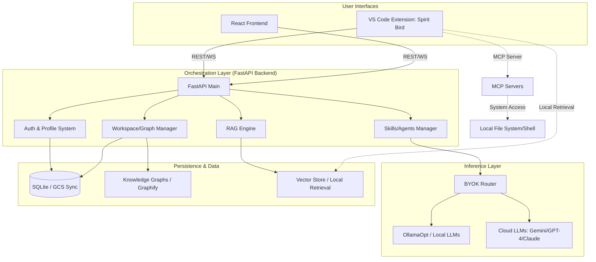

# AI_Codex Workspace Analysis

## Project Overview
**AI_Codex** (AdaptivIntelligenceCodex) is a sophisticated agentic AI ecosystem designed for Senior AI Engineers. It provides a full-stack pipeline for code generation, architecture mapping, and local/cloud LLM orchestration.

### Core Architecture
The system is divided into three primary interfaces:
1.  **Backend (FastAPI):** The central nervous system handling orchestration, RAG, user management, and LLM routing.
2.  **Client (React/Vite):** A web-based dashboard for interacting with the Codex.
3.  **VS Code Extension (TypeScript):** A deeply integrated IDE plugin ("Spirit Bird") that brings the agent's capabilities directly into the development environment.

---

## Component Analysis

### 1. Backend (`/backend`)
- **Framework:** FastAPI.
- **Database:** SQLite (with GCS sync for Cloud Run deployments).
- **Key Modules:**
    - `api/`: Contains routers for `auth`, `chat`, `rag`, `skills`, `workspace`, and `admin`.
    - `integrations/`: Specifically `ollamaopt_bridge` for optimized local inference.
    - `db/`: SQLAlchemy models and session management.
- **Special Features:**
    - **OllamaOpt:** Local LLM execution with context window management.
    - **BYOK Routing:** Support for Gemini, OpenAI, and Anthropic.
    - **Graphify Integration:** Generates structural codebase maps stored in `/data/workspaces`.

### 2. Client (`/client`)
- **Stack:** React, TypeScript, Vite, Tailwind CSS.
- **Purpose:** Provides a UI for managing conversations, viewing knowledge graphs, and configuring system settings.

### 3. VS Code Extension (`/vscode-extension`)
- **Name:** Spirit Bird - CodexSpaces.
- **Capabilities:**
    - Integrated Chat View (Webview).
    - Context-aware code generation from comments.
    - Automated commit message generation.
    - MCP (Model Context Protocol) server integration for extended tool use.
    - Local semantic retrieval from the workspace.

### 4. Supporting Infrastructure
- **Agents & Skills:** Organized into `mendatory` and `situational` directories, suggesting a modular capability system.
- **MCP:** A dedicated folder for Model Context Protocol servers, enabling the AI to execute external tools.
- **Data:** Workspace-specific graphs and database files are managed in the `/data` directory.

---

## Dependency & Data Flow Map

## Critical Paths & Potential Bottlenecks

### 1. State Persistence: The GCS $\leftrightarrow$ SQLite Bridge
**Path:** `Lifespan Event` $\rightarrow$ `download_db_from_gcs()` $\rightarrow$ `SQLite` $\rightarrow$ `upload_db_to_gcs()`.
- **The Risk:** Since Cloud Run is stateless, the entire application state resides in a SQLite file synced via GCS. 
- **Bottlenecks:** 
    - **Cold Start Latency:** On a cold start, the backend must download the DB before it can serve requests. As the DB grows, this increases TTFB (Time to First Byte).
    - **Race Conditions:** If multiple instances spin up, the "last write wins" strategy during shutdown could lead to data loss or state corruption.
    - **Atomic Failures:** A crash during the `yield` phase of the lifespan might skip the upload, causing the loss of all session data since the last boot.

### 2. Local Inference: The OllamaOpt Bridge
**Path:** `Backend API` $\rightarrow$ `ollamaopt_bridge` $\rightarrow$ `Local Ollama Instance` $\rightarrow$ `GPU/CPU`.
- **The Risk:** Local LLMs are resource-heavy. The bridge must manage context windows and queueing to prevent the backend from hanging.
- **Bottlenecks:**
    - **Context Overflow:** Inefficient management of the prompt window in the bridge can lead to "forgetting" or crashing the local model.
    - **I/O Blocking:** If the bridge uses synchronous calls to Ollama, it may block the FastAPI event loop, killing the responsiveness of the rest of the API.

### 3. The "Spirit Bird" Extension Latency
**Path:** `VS Code` $\rightarrow$ `Local Semantic Retrieval` $\rightarrow$ `Backend API` $\rightarrow$ `LLM Response`.
- **The Risk:** The extension performs "Local Semantic Retrieval" before sending requests.
- **Bottlenecks:**
    - **Indexing Overhead:** Large workspaces may cause the `@huggingface/transformers` (used in the extension) to consume significant RAM, slowing down the IDE.
    - **Network Hop:** High-latency connections to the Cloud Run backend can make the "real-time" code generation feel sluggish.

### 4. Security & Trust: The MCP Shell Execution
**Path:** `VSC Extension` $\rightarrow$ `MCP Server` $\rightarrow$ `System Shell` $\rightarrow$ `File System`.
- **The Risk:** The `trustMode` setting allows the AI to execute shell commands without a prompt.
- **Bottlenecks:**
    - **Permission Escalation:** If the AI is tricked (Prompt Injection), it could execute destructive commands. The "bottleneck" here is not performance, but a "trust bottleneck" where the user must choose between productivity (Trust Mode ON) and safety (Trust Mode OFF).

### 5. The Knowledge Graph Generation (Graphify)
**Path:** `Workspace Request` $\rightarrow$ `Graphify` $\rightarrow$ `HTML Graph Generation` $\rightarrow$ `Static Mount`.
- **The Risk:** Generating a full structural map of a large codebase is computationally expensive.
- **Bottlenecks:**
    - **CPU Spikes:** Running Graphify on a large repo can pin the CPU, potentially causing the FastAPI backend to timeout on other requests.
    - **Static File Serving:** Serving large HTML graphs through FastAPI's `StaticFiles` mount is efficient, but the initial generation is the primary bottleneck.
