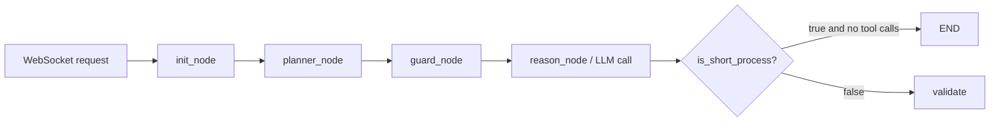
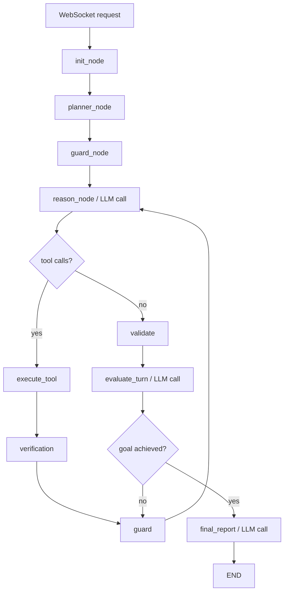
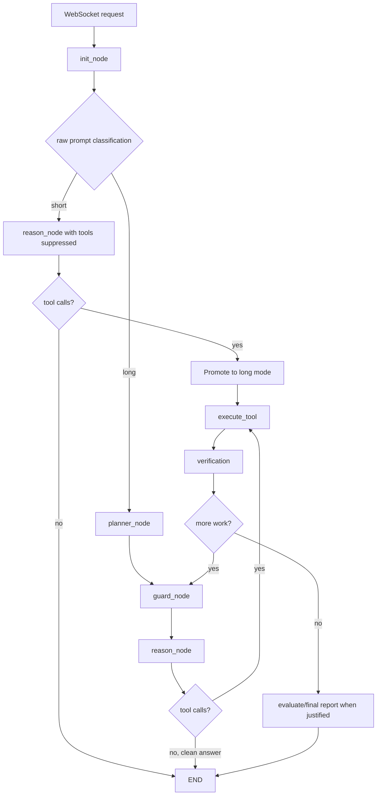
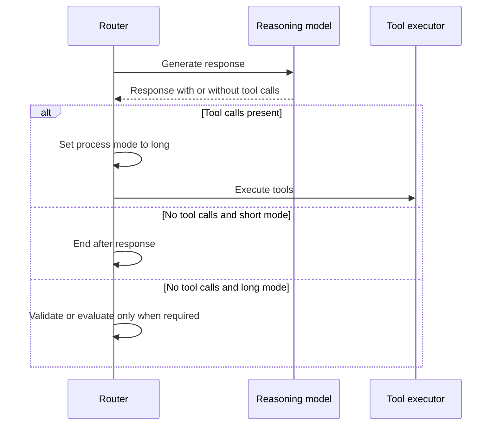
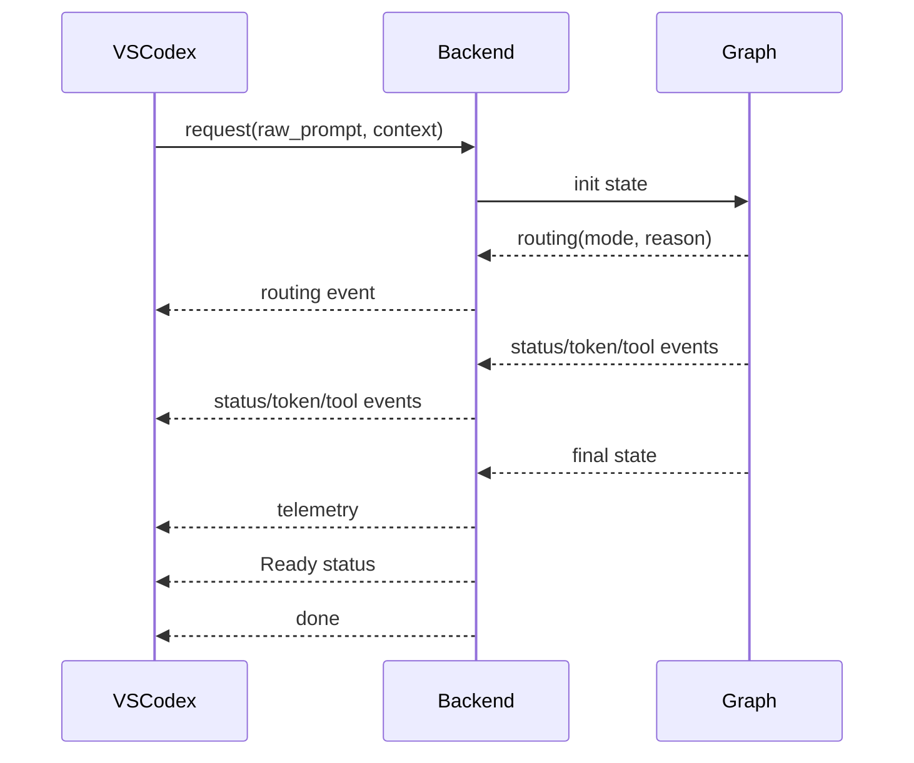
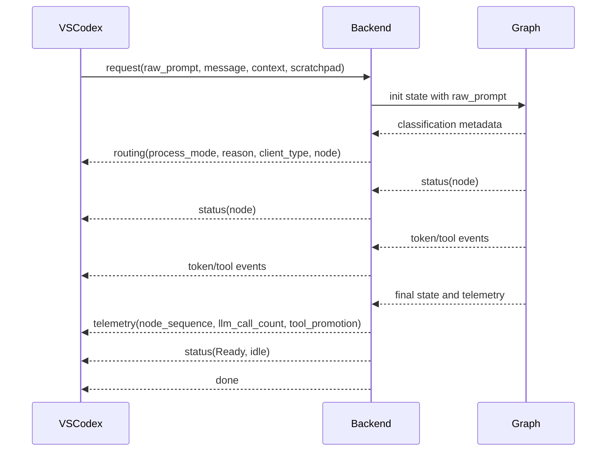

# Agent Harness Process Flow

Date: 2026-07-23

## Historical short-process flow

Before remediation, the short flag skipped downstream quality nodes, but planner and guard were still entered.

## Historical long-process flow

## Implemented optimized flow

For VSCodex, the request now carries `raw_prompt` separately from enriched `message` context. The classifier uses only `raw_prompt`; workspace context, attachments, retrieval data, and MCP tools remain available to the reasoning path.

## Tool-call promotion and safety behavior

## WebSocket event lifecycle

The implemented VSCodex request/event contract is:

The remaining verification work is a deterministic authenticated WebSocket test for this event order and for timeout/error terminal behavior.

