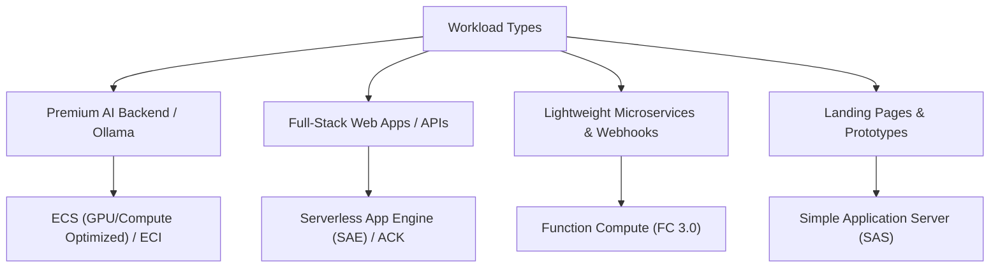
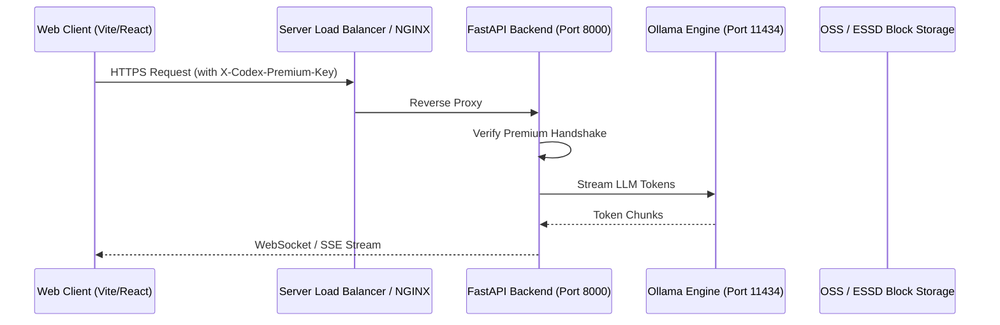

# Alibaba Cloud Architecture & Deployment Blueprint

This document provides a high-level roadmap and reference guide for configuring your **Alibaba Cloud** account, hosting the **Premium GPU/Inference Backend** (AI Codex / Ollama), and standardizing deployment patterns across your future projects.

> Updated baseline status (2026-09-02): this repository is currently Cloud Run-first and should not be treated as an existing Alibaba deployment. The Alibaba path below is an additive future target for the premium inference backend only, while the active production deployment remains the current Google Cloud Run workflow.

---

## 1. Current Repo Reality vs. Future Alibaba Target

### Current repo baseline
- The active deployment path is the Google Cloud Run pipeline documented in [deploy_production.bat](../deploy_production.bat).
- The backend container is Cloud Run-oriented and exposes the service port expected by the current deployment flow.
- The repo does not yet contain a Terraform root, Alibaba VPC topology, or an actual production Alibaba deployment definition.

### Future Alibaba target
- Add Alibaba Cloud as a separate deployment target for the premium inference backend.
- Keep the existing Cloud Run deployment path stable while implementing the Alibaba path in parallel.
- Start with a dev-only ACR + GPU ECS deployment, then expand to staging and production after smoke checks and approval.

---

## 2. Executive Summary & Recommended Compute Mapping

Alibaba Cloud offers multiple compute layers depending on resource intensity, statefulness, and scale:



| Project Category | Recommended Alibaba Service | Why? |
| :--- | :--- | :--- |
| **Premium Backend (AI/Ollama)** | **ECS (gn7i/gn6v GPU or c7/g7 Compute)** | Dedicated CUDA/GPU acceleration, full control over local LLM runtime, high network throughput. |
| **Microservices / Standard APIs** | **Serverless App Engine (SAE)** | Zero server management, auto-scaling from 0 to N, native container/Docker support. |
| **Serverless / Event-Driven Tasks** | **Function Compute (FC)** | Pay-per-millisecond execution for isolated tasks (embeddings, webhooks, crons). |
| **Small Prototypes / Static Sites** | **Simple Application Server (SAS)** | Fixed-cost, all-in-one bundled compute + bandwidth for hobby/testing projects. |

---

## 2. Phase 1: Account Foundation & Security Setup

Setting up a secure foundation prevents unauthorized access and avoids unexpected billing.

### Step 1: Account & Billing Safeguards
1. **Activate Free Tier & Trials:** Claim free trial products (ECS credits, OSS storage, AI tokens) via the [Getting Started Campaign](https://www.alibabacloud.com/en/campaign/getting-started-guide).
2. **Budget Alerts:** Configure **Billing & Cost Management** $\rightarrow$ **Cost Alert / Budget Thresholds** to receive email/SMS notifications if spending exceeds set limits.
3. **MFA Enforcement:** Enable Multi-Factor Authentication (TOTP / Authenticator App) on the root account.

### Step 2: IAM / Resource Access Management (RAM)
> [!IMPORTANT]
> Never use Root Account Access Keys for CI/CD or runtime code.
1. Create a dedicated **RAM User** for CI/CD (e.g., `github-actions-deployer`).
2. Attach least-privilege system policies (e.g., `AliyunECSFullAccess`, `AliyunSAEFullAccess`, or `AliyunContainerRegistryFullAccess`).
3. Generate **RAM AccessKey ID & Secret** and store them securely in your GitHub Secrets or `.env` manager.

### Step 3: Networcdk & VPC Topology
1. Create a primary **Virtual Private Cloud (VPC)** in your target region (e.g., `ap-southeast-1` Singapore or `eu-central-1` Frankfurt).
2. Provision **VSwitches** across at least 2 Availability Zones for high availability. Recommended names and ranges for the first implementation:
   - `aicodex-vpc` = `10.10.0.0/16`
   - `aicodex-vsw-az1` = `10.10.1.0/24`
   - `aicodex-vsw-az2` = `10.10.2.0/24`
3. Configure a baseline **Security Group**:
   - Inbound: `22` (SSH - restricted to your IP), `80/443` (HTTP/HTTPS), `8000` (FastAPI / Codex Backend).
   - Inbound: `11434` (Ollama - keep private or protect with security key/proxy).

These names and CIDRs are the current implementation baseline for the first Alibaba dev deployment and should be kept consistent in any Terraform or CLI automation.

---

## 3. Phase 2: Hosting the Premium Backend

The premium backend requires running FastAPI alongside Ollama/vLLM with persistent storage and optional GPU acceleration.



### Architecture Options for Premium Backend

#### Option A: Dedicated GPU ECS (Recommended for Production LLMs)
- **Instance Type:** `ecs.gn7i-c8g1.2xlarge` (NVIDIA A10) or compute-optimized `ecs.c7.2xlarge` (for quantized CPU inference).
- **Disk:** 100GB+ **Enhanced SSD (ESSD)** for model weights (`~/.ollama/models`).
- **Setup Flow:**
  1. Boot Ubuntu 22.04 with NVIDIA driver pre-installed (or use Alibaba Cloud AI GPU images).
  2. Install Docker & NVIDIA Container Toolkit.
  3. Deploy via Docker Compose:
     ```yaml
     services:
       fastapi-backend:
         image: registry.alibabacloud.com/your-org/codex-backend:latest
         ports:
           - "8000:8000"
         environment:
           - OLLAMA_BASE_URL=http://ollama:11434
           - COLAB_SECRET=your_secure_premium_key
       ollama:
         image: ollama/ollama:latest
         deploy:
           resources:
             reservations:
               devices:
                 - driver: nvidia
                   count: all
                   capabilities: [gpu]
         volumes:
           - /mnt/models:/root/.ollama
     ```

#### Option B: Serverless App Engine (SAE) + Elastic Container Instance (ECI)
- Ideal if you want the API server to scale down to zero when idle and only spin up compute on demand.
- Mount model storage to **NAS (Network Attached Storage)** or **OSS (Object Storage Service)**.

---

## 4. Phase 3: Multi-Project Deployment Framework

To easily deploy future projects without reinventing the wheel, adopt a 3-pillar framework:

### 1. Unified Container Registry (ACR)
- Use **Alibaba Cloud Container Registry (ACR Personal/Enterprise Edition)**.
- Store Docker images for all your projects (`frontend`, `backend-api`, `data-pipeline`).
- Free tier includes generous personal registry quotas.

### 2. CI/CD Pipeline (GitHub Actions $\rightarrow$ Alibaba Cloud)
Standardize your deployment workflow:
1. **Build & Test:** GitHub Actions builds Docker image.
2. **Push:** Pushes image to ACR (`registry.<region>.aliyuncs.com/<namespace>/<app>:<tag>`).
3. **Deploy:** Triggers ECS via **Cloud Assistant (OOS)** or updates an **SAE / Function Compute** revision.

### 3. Infrastructure as Code (IaC) with Terraform
Store your infrastructure definitions in git alongside your applications:
- Define VPCs, Security Groups, ECS/SAE apps, and DNS records using the `aliyun/alicloud` Terraform provider.
- Enables spin-up and teardown in minutes across different environments (Staging vs. Production).

---

## 5. Implementation Checklist & Next Actions

- [ ] **Step 1:** Complete Identity & Billing verification on Alibaba Cloud Console.
- [ ] **Step 2:** Create a RAM User with Access Keys & restricted permissions.
- [ ] **Step 3:** Provision a VPC & Security Group in your chosen region.
- [ ] **Step 4:** Set up Alibaba Cloud Container Registry (ACR) namespace for your projects.
- [ ] **Step 5:** Deploy initial Premium Backend instance (ECS or SAE) and configure the `X-Codex-Premium-Key` handshake.
- [ ] **Step 6:** Point frontend API URL / domain via Alibaba Cloud DNS (Alidns) or Cloudflare.
