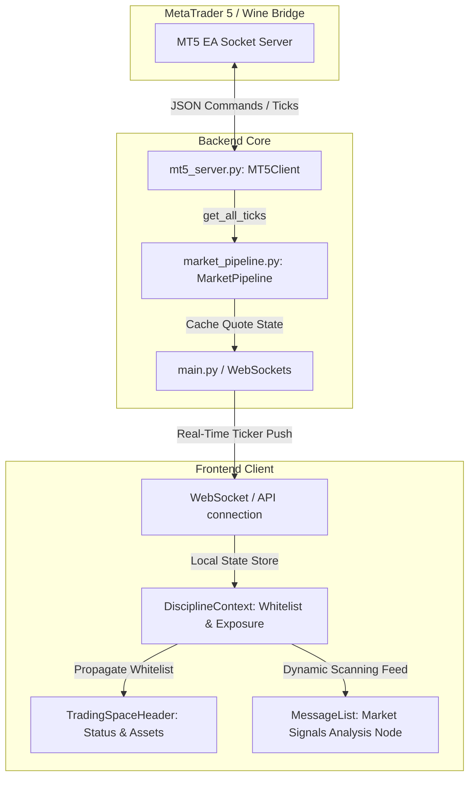

# FinQuant Terminal: Signals & Pipeline Architecture

This document specifies the architecture, data streams, and dependency layout for the **FinQuant Terminal** (formerly the Alpha Terminal) workspace inside AICodex. It aligns real-time pricing pipelines, execution rules, and UI rendering layers into a unified specification.

---

## 1. System Topology & Data Flow



---

## 2. Dynamic Signal Generation Logic

The **Market Signals Analysis Node** acts as the gateway welcome state for traders entering the terminal workspace. It runs an autonomous diagnostic loop that aggregates:
1. **Spread & Liquidity Analysis**: Cross-referencing current quotes fetched by the `MarketPipeline` from the MT5 socket bridge.
2. **Sentiment Analysis**: Analyzing directional shifts (Bullish/Bearish) using momentum indices calculated from tick frequency.
3. **Execution Whitelist Validation**: Ensuring that only assets listed under the `allowedSymbolsWhitelist` in `DisciplineContext.tsx` are qualified for signal scanning.

### Signal Schema Definition

```typescript
interface FinQuantSignal {
  symbol: string;         // Asset ticker identifier (e.g. BTCUSD, XAUUSD, TSLA)
  sentiment: 'BULLISH' | 'BEARISH';
  strength: number;       // Quantitative score (70% - 98%)
  confidence: 'High' | 'Medium' | 'Extreme';
  dataStreams: number;    // Number of aggregated data lines scanned (8 - 25)
  description: string;    // Contextual description of the market structure
}
```

---

## 3. Frontend & Backend Dependency Unification

To maintain clean architecture and prevent coupling degradation, files are organized according to strict modular responsibilities:

### A. Backend Services
* **[mt5_server.py](file:///c:/AppDev/My_Linkdin/projects/iarxii/AI_Codex/backend/integrations/mt5_server.py)**: Low-level TCP socket client facilitating command/response exchange with the MT5 Wine Container.
* **[market_pipeline.py](file:///c:/AppDev/My_Linkdin/projects/iarxii/AI_Codex/backend/integrations/market_pipeline.py)**: Polling loop aggregator running at 1Hz, caching the standard pricing dictionary (`quote_cache`).

### B. Client Contexts & Stores
* **[DisciplineContext.tsx](file:///c:/AppDev/My_Linkdin/projects/iarxii/AI_Codex/client/src/contexts/DisciplineContext.tsx)**: Manages limits, whitelisted symbols, drawdown ceilings, and exposure percentages.
* **[AIContext.tsx](file:///c:/AppDev/My_Linkdin/projects/iarxii/AI_Codex/client/src/contexts/AIContext.tsx)**: Manages workspaces, settings, active provider nodes, and model allocations.

### C. UI Presentation Layer
* **[TradingSpaceHeader.tsx](file:///c:/AppDev/My_Linkdin/projects/iarxii/AI_Codex/client/src/components/spaces/trading/TradingSpaceHeader.tsx)**: Sticky workspace profile showing connection health, status pills (LIVE/ERROR), and interactive charts.
* **[MessageList.tsx](file:///c:/AppDev/My_Linkdin/projects/iarxii/AI_Codex/client/src/components/chat/MessageList.tsx)**: Dynamically renders the *Market Signals Analysis Node* in the Welcome phase based on the simulated aggregation of whitelisted tickers.

---

## 4. Unification Guidelines & Best Practices

1. **Keep Component States Grounded**: Never duplicate whitelist constants. Components needing valid symbols must fetch them dynamically from `useDiscipline().state.allowedSymbolsWhitelist`.
2. **Handle Disconnections Gracefully**: Ensure that any UI module referencing the "LIVE" status (like the `TradingSpaceHeader`) transitions immediately to "ERROR" (red style) if socket latency fails or the WebSocket connection drops (`connected === false`).
3. **Trace Errors with Intent**: Apply static analysis to track connection parameters, ensuring that the backend's `MarketPipeline` does not block main event loop processing when the MT5 bridge experiences host network errors.
