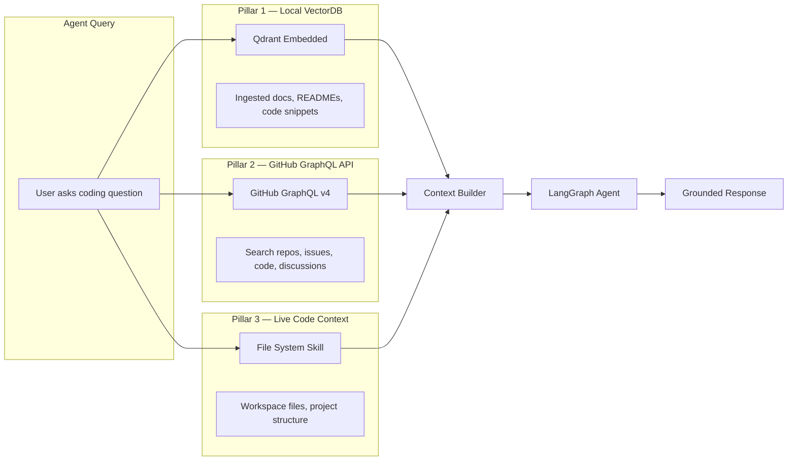
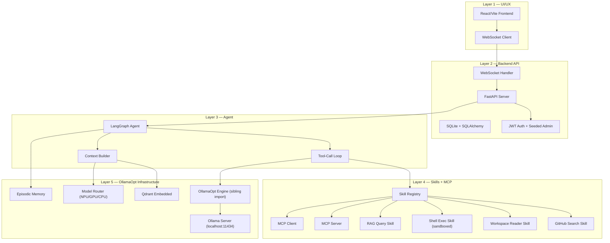

# AICodex — Refocus & Rebuild Plan (v2)

A workflow platform for local agentic AI development using open-source integrations, inspired by OpenClaw but scoped for local-first Intel-optimized hardware.

---

## Current State Diagnosis

### AI_Codex — Fragmented & Disconnected

| Subsystem | Tech | Status | Verdict |
|:----------|:-----|:-------|:--------|
| `client/` | React/Vite/TS + Tailwind v4 | Basic chat UI, hardcoded Gemini provider | **KEEP scaffold, redesign** |
| `server/` | Node.js/Express | REST chat (OpenAI+Gemini), Chroma RAG, SQLite | **REPLACE with Python** |
| `mcp/` | TypeScript MCP SDK | Boilerplate CRUD tools, no integration | **REPLACE with Python MCP** |
| `Agents/langgraph/` | Python/LangGraph | Minimal chatbot, no tools | **REWRITE** |
| `Agents/google_adk/` | Python/Google ADK | Hello-world weather agent | **ARCHIVE** |
| `client-deprecate/` | Vanilla JS | Dead code | **DELETE** |
| `db_lite/` | SQLite | Chat persistence | **MIGRATE to backend** |

> [!WARNING]
> **Core Problem**: Zero integration between subsystems. Three different DB strategies, two brand names. The refocus consolidates to **one backend** (FastAPI), **one database** (SQLite via SQLAlchemy), **one vector store** (Qdrant embedded), and **one brand** — **AICodex**.

### OllamaOpt — Useful but Unvalidated

OllamaOpt has a well-structured Python pipeline that *should* serve as the inference backbone:

| Module | Capability | Reuse Strategy |
|:-------|:-----------|:---------------|
| `cli/rag/` | Qdrant vector store (embedded), chunker, embedder, retriever | **Import via path** |
| `cli/memory/` | Session state + episodic memory (Qdrant-backed) | **Import via path** |
| `cli/context/` | Budget-aware prompt assembly with provenance | **Import via path** |
| `cli/routing/` | NPU/GPU/CPU tiered model routing | **Import via path** |
| `cli/metrics_collector.py` | Token & latency tracking | **Import via path** |

> [!NOTE]
> OllamaOpt has **not been validated in practice** yet. The code looks solid structurally, but runtime issues may surface during integration. The plan accounts for this by wrapping all OllamaOpt imports with graceful fallbacks (the same pattern OllamaOpt itself already uses internally — see `_init_integration_components()` in `chat_interface.py`). We'll validate each module as we wire it in.

---

## Decisions (Confirmed)

| Decision | Resolution |
|:---------|:-----------|
| **Branding** | **AICodex** — all references to HealthMedAgentix, AdaptivIntelligenceCodex removed |
| **Agent Framework** | **LangGraph** as sole framework. Google ADK archived. |
| **Backend** | **Python FastAPI** replaces Node.js Express entirely |
| **OllamaOpt Integration** | **Sibling path import** — no copy, no submodule (see details below) |
| **Auth** | **Yes** — basic JWT auth with a seeded admin account |
| **Skill Sandboxing** | **Subprocess sandbox with allowlist** (see details below) |
| **Execution** | **User gives the command** — plan is reviewed first |

---

## OllamaOpt Integration: Sibling Path Import

> [!IMPORTANT]
> **Why not a submodule?** You don't have disk space for a duplicate copy, and OllamaOpt is still being refined. A Git submodule would create a second checkout of the entire repo inside AI_Codex.

**The approach**: Both repos live as siblings under `projects/iarxii/`. The AICodex backend adds OllamaOpt's directory to the Python path at startup, allowing direct imports of its modules without any copy:

```
c:\AppDev\My_Linkdin\projects\iarxii\
├── AI_Codex/         ← this project
│   └── backend/
│       └── integrations/
│           └── ollamaopt_bridge.py   ← adds sibling to sys.path
└── OllamaOpt/        ← imported from here (zero copy)
    └── cli/
        ├── rag/
        ├── memory/
        ├── context/
        └── routing/
```

```python
# backend/integrations/ollamaopt_bridge.py
import sys
from pathlib import Path

# Resolve sibling OllamaOpt directory relative to AI_Codex root
OLLAMAOPT_ROOT = Path(__file__).resolve().parents[3] / "OllamaOpt"
if OLLAMAOPT_ROOT.exists() and str(OLLAMAOPT_ROOT) not in sys.path:
    sys.path.insert(0, str(OLLAMAOPT_ROOT))
```

**Benefits**:
- Zero disk overhead — no copy
- Changes to OllamaOpt are immediately visible to AICodex
- OllamaOpt stays its own repo, can be refined independently
- Config points to sibling path, easily changed if repos move

**Risk mitigation**: All imports are wrapped in `try/except` with clear error messages. If OllamaOpt modules fail to load, the backend still starts but those features are disabled.

---

## Skill Sandboxing: Subprocess with Allowlist

> [!TIP]
> **Safest + easiest approach** for v1: Skills that execute shell commands or code run in a **subprocess with timeout + allowlist**. No Docker, no VM, no complex setup.

```python
# backend/skills/sandbox.py
ALLOWED_COMMANDS = {"git", "python", "pip", "node", "npm", "dir", "type", "cat", "ls"}
MAX_EXECUTION_TIME = 30  # seconds
MAX_OUTPUT_SIZE = 10_000  # characters

async def execute_sandboxed(command: str, cwd: str) -> SandboxResult:
    base_cmd = command.split()[0].lower()
    if base_cmd not in ALLOWED_COMMANDS:
        return SandboxResult(error=f"Command '{base_cmd}' not in allowlist")

    proc = await asyncio.create_subprocess_shell(
        command, cwd=cwd, stdout=PIPE, stderr=PIPE
    )
    try:
        stdout, stderr = await asyncio.wait_for(
            proc.communicate(), timeout=MAX_EXECUTION_TIME
        )
    except asyncio.TimeoutError:
        proc.kill()
        return SandboxResult(error="Execution timed out")

    return SandboxResult(
        stdout=stdout.decode()[:MAX_OUTPUT_SIZE],
        stderr=stderr.decode()[:MAX_OUTPUT_SIZE],
        return_code=proc.returncode,
    )
```

**Guardrails**:
- Allowlist of permitted base commands (configurable in `.env`)
- 30-second timeout (kills process if exceeded)
- Output size cap (10K chars — prevents memory bombs)
- No `rm`, `del`, `format`, `shutdown` etc. in default allowlist
- Admin can expand allowlist via settings

---

## RAG + Code Intelligence Strategy

> [!IMPORTANT]
> **Why this matters**: 3B models (llama3.2:3b, etc.) have limited training data and struggle with nuanced coding problems. RAG augmentation is **essential** — it transforms the agent from a pattern-matcher into a grounded problem-solver with access to real documentation and live code repositories.

### Three-Pillar Retrieval Architecture



### Pillar 1 — Local VectorDB (Qdrant Embedded)

Uses OllamaOpt's existing `cli/rag/` pipeline directly:

| Component | OllamaOpt Module | Purpose |
|:----------|:-----------------|:--------|
| Store | `rag.store.QdrantVectorStore` | Embedded Qdrant (no server needed) |
| Embedder | `rag.embedder.OllamaEmbedder` | `nomic-embed-text` via Ollama |
| Chunker | `rag.chunker.Chunker` | Recursive text splitting |
| Retriever | `rag.retriever.Retriever` | Top-K with score threshold |
| Ingestion | `rag.ingestion` | Document loading + chunking + embedding |

**What gets ingested**:
- Framework documentation (LangChain, FastAPI, React docs)
- Your own project READMEs and code files
- Stack Overflow curated Q&A exports
- Custom knowledge bases you upload via the UI

**RAG API endpoints**:
- `POST /api/rag/ingest` — Upload files/URLs for ingestion
- `POST /api/rag/query` — Direct query (returns chunks + scores)
- `GET /api/rag/collections` — List collections and stats
- `DELETE /api/rag/collections/{name}` — Clear a collection

### Pillar 2 — GitHub GraphQL API (Code Intelligence Skill)

A dedicated **built-in skill** that the LangGraph agent can call to search GitHub when local knowledge isn't sufficient:

#### [NEW] `backend/skills/builtin/github_search.py`

```python
class GitHubSearchSkill(BaseSkill):
    name = "github_search"
    description = "Search GitHub repositories, code, issues and discussions for solutions"

    async def execute(self, query: str, search_type: str = "code") -> SkillResult:
        """
        search_type: "code" | "repository" | "issue" | "discussion"

        Uses GitHub GraphQL API v4 for efficient, structured queries.
        Results are formatted as context chunks for the agent.
        """
```

**GitHub GraphQL queries the agent can make**:

| Search Type | GraphQL Query | Use Case |
|:------------|:-------------|:---------|
| `code` | `search(query: "...", type: CODE)` | Find implementation patterns, API usage examples |
| `repository` | `search(query: "...", type: REPOSITORY)` | Discover libraries, frameworks, tools |
| `issue` | `search(query: "...", type: ISSUE)` | Find bug reports, known issues, workarounds |
| `discussion` | `search(query: "...", type: DISCUSSION)` | Community solutions, Q&A threads |

**Auth**: Uses a GitHub Personal Access Token (PAT) stored in `.env`. Free tier allows 5,000 requests/hour — more than sufficient for agent use.

**Smart caching**: GitHub search results are automatically ingested into the local VectorDB with a `source: "github"` tag. This means:
1. First time: Agent queries GitHub API → gets results → caches in Qdrant
2. Next time: Same question hits Qdrant first → no API call needed
3. Knowledge compounds over time

### Pillar 3 — Live Code Context (File System Skill)

The agent can read and analyze your actual project files:

#### [NEW] `backend/skills/builtin/workspace_reader.py`

```python
class WorkspaceReaderSkill(BaseSkill):
    name = "workspace_reader"
    description = "Read files and directory structure from configured workspaces"

    async def execute(self, path: str, action: str = "read") -> SkillResult:
        """
        action: "read" | "list" | "search"
        - read: Return file contents
        - list: Return directory tree
        - search: Grep for patterns in workspace
        """
```

### How the Agent Uses All Three Pillars

The LangGraph agent's tool-calling loop naturally orchestrates all three:

```
User: "How do I set up WebSocket streaming in FastAPI?"

Agent reasoning:
  1. Check local VectorDB → finds 2 relevant chunks (score 0.72, 0.65)
  2. Scores are moderate, supplement with GitHub search
  3. Call github_search(query="fastapi websocket streaming", type="code")
     → Gets 5 code examples from popular repos
  4. Cache GitHub results in VectorDB for future use
  5. Assemble context: VectorDB chunks + GitHub examples
  6. Generate grounded answer with code examples and citations
```

This is where the **ContextBuilder** (from OllamaOpt) is critical — it handles the budget-aware assembly of all these sources into a prompt that fits the 3B model's context window, trimming in priority order (history first, then memory, then tools, then retrieved docs).

---

## Proposed Architecture

### Five-Layer Design



---

## Proposed Changes

### Component 1: Project Restructure

#### [DELETE] `server/` — Node.js backend
Replaced entirely by Python FastAPI. All routes reimplemented.

#### [DELETE] `client-deprecate/`
Dead code.

#### [ARCHIVE] `Agents/google_adk/` → `archive/google_adk/`
Preserved for reference, not part of the platform.

#### [DELETE] `Agents/langgraph/`
Rewritten from scratch in `backend/agent/`.

#### [DELETE] Root `package.json`
Root is now a Python project.

#### [MODIFY] [README.md](file:///c:/AppDev/My_Linkdin/projects/iarxii/AI_Codex/README.md)
Complete rewrite with AICodex branding, architecture overview, and setup instructions.

---

### Component 2: Python Backend (`backend/`)

#### [NEW] `backend/main.py`
FastAPI app with CORS, WebSocket, JWT middleware, route mounting. Imports OllamaOpt on startup.

#### [NEW] `backend/config.py`
Pydantic Settings: Ollama URL, Qdrant paths, model defaults, skill dirs, GitHub PAT, OllamaOpt path.

#### [NEW] `backend/api/auth.py`
- `POST /api/auth/login` — JWT token generation
- `GET /api/auth/me` — Current user info
- Admin seed on first startup: `admin / admin123` (changeable)

#### [NEW] `backend/api/chat.py`
- `POST /api/chat` — Simple chat (non-agentic, direct Ollama)
- `WS /ws/agent` — WebSocket for agentic chat with tool-call event streaming
- `GET /api/conversations` — List conversations
- `GET /api/conversations/{id}` — Get conversation with messages

#### [NEW] `backend/api/models.py`
- `GET /api/models` — List available Ollama models
- `POST /api/models/pull` — Pull a new model
- `GET /api/models/status` — Hardware tier, GPU status, active model

#### [NEW] `backend/api/rag.py`
- `POST /api/rag/ingest` — Upload and ingest documents (PDF, MD, TXT, code)
- `POST /api/rag/query` — Query the vector store directly
- `GET /api/rag/collections` — List collections and stats
- `DELETE /api/rag/collections/{name}` — Clear a collection

#### [NEW] `backend/api/skills.py`
- `GET /api/skills` — List registered skills
- `POST /api/skills` — Register a custom skill
- `PATCH /api/skills/{id}` — Enable/disable a skill
- `POST /api/skills/{id}/test` — Test-execute a skill

#### [NEW] `backend/db/models.py`
SQLAlchemy models: `User`, `Conversation`, `Message`, `Skill`, `ToolCall`, `RAGCollection`.

#### [NEW] `backend/db/session.py`
Async SQLite session factory. Auto-creates tables + seeds admin on startup.

---

### Component 3: LangGraph Agent (`backend/agent/`)

#### [NEW] `backend/agent/state.py`
```python
class AgentState(TypedDict):
    messages: Annotated[list, add_messages]
    tool_calls: list          # Track tool invocations for UI rendering
    context: str              # Assembled context from ContextBuilder
    current_model: str        # Active model name
    route_decision: dict      # NPU/GPU/CPU routing info
```

#### [NEW] `backend/agent/graph.py`
LangGraph `StateGraph` with three nodes:
1. **`reason`** — LLM call with tool bindings. Uses `ChatOllama.bind_tools()`
2. **`execute_tool`** — Dispatches to SkillRegistry, captures result
3. **`respond`** — Final synthesis with all context

Conditional edge: `reason → execute_tool` (if tool_calls present) → `reason` (loop) or `reason → END`.

#### [NEW] `backend/agent/nodes.py`
Node implementations. The `reason` node integrates OllamaOpt's ContextBuilder to assemble RAG + memory context before each LLM call.

#### [NEW] `backend/agent/tools.py`
Bridge layer: auto-converts every registered `BaseSkill` into a LangChain `StructuredTool` for `bind_tools()`.

---

### Component 4: Skills Layer (`backend/skills/`)

#### [NEW] `backend/skills/base.py`
```python
class BaseSkill(ABC):
    name: str
    description: str
    parameters: dict  # JSON Schema for tool params

    @abstractmethod
    async def execute(self, **kwargs) -> SkillResult: ...

    def to_langchain_tool(self) -> StructuredTool: ...
    def to_mcp_tool(self) -> dict: ...
```

#### [NEW] `backend/skills/sandbox.py`
Subprocess sandbox with allowlist, timeout, and output cap (see Sandboxing section above).

#### [NEW] `backend/skills/registry.py`
Auto-discovers skills from `builtin/` and `custom/`. Provides `get_all_tools()` for LangGraph.

#### [NEW] `backend/skills/builtin/github_search.py`
GitHub GraphQL API skill — code, repo, issue, discussion search with auto-caching to VectorDB.

#### [NEW] `backend/skills/builtin/workspace_reader.py`
Read files, list directories, grep patterns in configured workspaces.

#### [NEW] `backend/skills/builtin/shell_exec.py`
Execute sandboxed shell commands with allowlist enforcement.

#### [NEW] `backend/skills/builtin/rag_query.py`
Agent-callable RAG query — lets the agent self-retrieve from the vector store.

#### [NEW] `backend/skills/builtin/web_search.py`
DuckDuckGo search (no API key, free tier).

---

### Component 5: MCP Integration (`backend/mcp_layer/`)

#### [NEW] `backend/mcp_layer/server.py`
Python MCP server (using `mcp` package) exposing all registered skills as MCP tools. Stdio transport.

#### [NEW] `backend/mcp_layer/client.py`
MCP client for consuming external MCP servers (configurable in settings).

---

### Component 6: OllamaOpt Bridge (`backend/integrations/`)

#### [NEW] `backend/integrations/ollamaopt_bridge.py`
Adds OllamaOpt sibling directory to `sys.path`. Provides wrapper functions with graceful fallbacks:
- `get_vector_store()` → `QdrantVectorStore`
- `get_context_builder()` → `ContextBuilder`
- `get_episodic_memory()` → `EpisodicMemory`
- `get_model_router()` → `ModelRouter`
- `get_retriever()` → `Retriever`

All wrapped in try/except — if OllamaOpt fails, clear error logged, feature disabled.

---

### Component 7: Frontend Redesign (`client/`)

#### [MODIFY] [App.tsx](file:///c:/AppDev/My_Linkdin/projects/iarxii/AI_Codex/client/src/App.tsx)
New routes: `/login`, `/chat` (protected), `/skills` (protected), `/rag` (protected), `/settings` (protected).

#### [NEW] `client/src/pages/AgentChat.tsx`
WebSocket chat with streaming + tool-call cards + model/tier indicator + context inspector.

#### [NEW] `client/src/pages/Skills.tsx`
Skill management grid with enable/disable, parameter editing, test execution.

#### [NEW] `client/src/pages/RAGManager.tsx`
Document upload, ingestion progress, collection stats, query tester.

#### [NEW] `client/src/components/ToolCallCard.tsx`
Renders tool invocations with collapsible input/output — the user sees *what* the agent is doing.

#### [NEW] `client/src/hooks/useAgentWebSocket.ts`
Handles WebSocket events: `token`, `tool_call_start`, `tool_call_result`, `error`, `done`.

#### [NEW] `client/src/services/api.ts`
Typed REST client with JWT auth headers for all backend endpoints.

---

## Target Directory Structure

```
AI_Codex/
├── client/                          # React/Vite frontend
│   └── src/
│       ├── pages/                   # Login, AgentChat, Skills, RAGManager, Settings
│       ├── components/              # ToolCallCard, SkillCard, ModelSelector
│       ├── hooks/                   # useAgentWebSocket, useModels, useAuth
│       └── services/                # api.ts (REST + WS client)
├── backend/                         # Python FastAPI
│   ├── main.py
│   ├── config.py
│   ├── api/                         # auth, chat, rag, skills, models
│   ├── agent/                       # LangGraph: graph, nodes, state, tools
│   ├── skills/
│   │   ├── base.py, registry.py, sandbox.py
│   │   ├── builtin/                 # github_search, workspace_reader,
│   │   │                            # shell_exec, rag_query, web_search
│   │   └── custom/
│   ├── mcp_layer/                   # server.py, client.py
│   ├── integrations/                # ollamaopt_bridge.py
│   ├── db/                          # models.py, session.py
│   └── requirements.txt
├── data/                            # Runtime (qdrant, memory, uploads)
├── archive/                         # google_adk, old experiments
├── docs/
├── .env.example
├── pyproject.toml
└── README.md
```

*OllamaOpt lives at `../OllamaOpt/` — imported via path, zero copy.*

---

## Execution Phases

### Phase 1 — Foundation (Backend + Agent Core)
- [ ] Restructure directories (archive/delete old code)
- [ ] Create FastAPI backend skeleton with config + auth + seeded admin
- [ ] Set up OllamaOpt sibling path import bridge
- [ ] Build LangGraph agent with basic tool-calling loop
- [ ] Implement chat API + WebSocket streaming
- [ ] Wire ContextBuilder + Retriever + Memory from OllamaOpt
- [ ] Validate OllamaOpt modules actually work at runtime

### Phase 2 — Skills Layer + RAG
- [ ] Define BaseSkill interface + sandbox
- [ ] Implement built-in skills (workspace_reader, shell_exec, rag_query)
- [ ] GitHub GraphQL API skill with auto-caching to VectorDB
- [ ] SkillRegistry with auto-discovery
- [ ] Bridge skills to LangGraph tools
- [ ] RAG ingest/query API endpoints
- [ ] Skills CRUD API

### Phase 3 — MCP Integration
- [ ] Python MCP server exposing skills as tools
- [ ] MCP client for external tool servers
- [ ] Agent integration with MCP tool dispatch

### Phase 4 — Frontend Redesign
- [ ] Login page + JWT auth flow
- [ ] Agent chat with WebSocket streaming
- [ ] Tool-call visualization cards
- [ ] Skills management UI
- [ ] RAG document management UI
- [ ] Model selector + hardware tier status

### Phase 5 — Polish
- [ ] Integration testing (end-to-end agent flow)
- [ ] Documentation overhaul
- [ ] Startup script (`start_aicodex.bat`)
- [ ] Performance tuning

---

## Verification Plan

### Automated Tests
- `pytest backend/tests/` — skill registry, agent graph, API endpoints, sandbox
- LangGraph loop test: message → tool decision → sandbox execution → grounded response

### Integration Test
```bash
# 1. Start Ollama
ollama serve

# 2. Start backend
cd backend && uvicorn main:app --reload --port 8000

# 3. Start frontend
cd client && npm run dev

# 4. Verify
curl http://localhost:8000/api/models          # Models list
curl http://localhost:8000/api/skills          # Skills list
curl http://localhost:8000/api/rag/collections # RAG stats
curl -X POST http://localhost:8000/api/auth/login \
  -d '{"username":"admin","password":"admin123"}'  # Auth
```

### Manual Verification
- Send chat → agent calls `github_search` → tool-call card renders → grounded answer
- Upload a PDF → ingest → query → RAG-augmented response with sources
- Register custom skill → appears in agent's available tools
