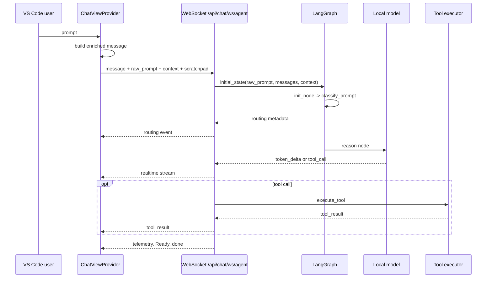

# Local Agent Realtime Code Mapping

Date: 2026-09-03

## Scope and verdict

This document maps the local agent request from the VS Code client through the backend graph and back to realtime events. It also records what the current local test actually proves.

**Current verdict:** the source-level routing and streaming path is implemented. The focused routing test executed successfully with the workspace's system Python, but the project virtualenv invocation was not usable in the current shell context. No authenticated Ollama WebSocket lifecycle test was executed.

## Request path



## Code mapping

| Stage | Owner | Responsibility | Evidence/status |
|---|---|---|---|
| User prompt assembly | [`vscode-extension/src/panels/ChatViewProvider.ts`](../vscode-extension/src/panels/ChatViewProvider.ts#L2241) | Builds `fullMessage` from the prompt, attachments, and workspace context. | Source verified. |
| Request contract | [`vscode-extension/src/api/types.ts`](../vscode-extension/src/api/types.ts#L16) | Declares `message`, optional `raw_prompt`, separate `context`, provider/model, and scratchpad fields. | Source verified. |
| WebSocket input | [`backend/api/chat.py`](../backend/api/chat.py#L96) | Authenticates the socket, reads `raw_prompt` with compatibility fallback to `message`, and accepts request context. | Source verified. |
| Graph initial state | [`backend/api/chat.py`](../backend/api/chat.py#L515) | Preserves enriched messages for model context while putting `raw_prompt` and `client_type` in graph state. | Source verified. |
| Classification | [`backend/agent/nodes.py`](../backend/agent/nodes.py#L386) and [`backend/agent/routing.py`](../backend/agent/routing.py#L72) | Classifies raw intent; records process mode, reason, indicators, client type, and prompt length. | Source verified. |
| Initial route | [`backend/agent/graph.py`](../backend/agent/graph.py#L99) | Short requests go to `reason`; long trading requests go to debate; other long requests go to planner. | Source verified. |
| Realtime graph stream | [`backend/api/chat.py`](../backend/api/chat.py#L650) | Converts graph lifecycle events into status, token, tool, result, error, and telemetry messages. | Source verified; authenticated lifecycle untested. |
| Routing event | [`backend/api/chat.py`](../backend/api/chat.py#L690) | Emits `routing` after `init` with process mode, reason, client type, and node. | Source verified. |
| Tool precedence | [`backend/agent/graph.py`](../backend/agent/graph.py#L14) | A returned tool call promotes a short classification to long mode before tool execution. | Source verified and asserted by the routing test. |
| Local provider | [`backend/agent/nodes.py`](../backend/agent/nodes.py#L250) | Uses `local_backend_mode`; Ollama uses its OpenAI-compatible endpoint, while llama.cpp uses the native local client path. | Source verified. |
| CLI observability | [`backend/debug_chat_cli.py`](../backend/debug_chat_cli.py#L138) | Prints routing/status/token/tool/result/error/done events and logs failures. | Source verified; CLI itself was not run. |

## Classification behavior

`classify_prompt()` uses the raw prompt and normalizes the client type.

- Greetings and acknowledgments are short.
- For `vscode` and `aidock`, prompts shorter than 45 characters are short unless they contain an action word, file extension, or path.
- Other client types default to long unless the prompt is a greeting or acknowledgment.
- Action indicators include words such as `create`, `fix`, `implement`, and `write`.
- A tool call overrides a short classification and changes the state to long mode.

This means `What is neural network?` is expected to be long for `web` and short for `vscode`; that is intentional client-specific behavior, not contradictory test data.

## What the local test proves

Target: [`backend/test_short_process_routing.py`](../backend/test_short_process_routing.py#L15)

The test covers:

- `init_node()` classification for greeting, web question, VS Code question, and VS Code action prompts.
- Classification of a VS Code raw prompt when the corresponding message contains 5,000 extra context characters.
- `route_after_init()` for short and trading states.
- `should_continue()` for short responses, tool calls, clean long responses, and action-bearing long responses.
- Tool-call promotion from short to long mode.

The test does **not** cover:

- An authenticated `/api/chat/ws/agent` connection.
- A live Ollama server or model response.
- Realtime event order or duplicate/missing terminal events.
- Actual extension-to-backend payload serialization.
- Tool execution over WebSocket.
- Request timeout behavior.
- Provider/model availability or API-key resolution.

## Validation record

The focused commands and results were:

```text
backend\\.venv\\Scripts\\python -m pytest backend/test_short_process_routing.py -q
python -m pytest backend/test_short_process_routing.py -q
```

The project virtualenv command could not run in the shell context used for validation because the expected repository path was not available to that invocation. The system Python command executed the test successfully:

```text
..                                                                       [100%]
2 passed in 3.54s
```

This is a fresh unit-test pass for `backend/test_short_process_routing.py`, covering classification and isolated graph routing. It is not an end-to-end WebSocket or live Ollama result. The repository's `.pytest_cache` contains a prior `test_short_process_heuristics` failure marker, but that cache is historical evidence only and is not a substitute for the fresh run above.

## Realtime event map

| Backend event | Produced by | Consumed by |
|---|---|---|
| `routing` | `init` graph completion in `backend/api/chat.py` | VS Code routing handler and [`debug_chat_cli.py`](../backend/debug_chat_cli.py#L138) fallback printer |
| `status` | Graph node entry and heartbeat monitor | VS Code progress UI and CLI status output |
| `token_delta` | Chat-model stream through `queue_token_delta()` | VS Code stream accumulator and CLI token handler |
| `tool_call` | Chat-model completion with tool calls | VS Code tool display and CLI tool output |
| `tool_result` | Tool completion | VS Code tool result display and CLI tool output |
| `telemetry` | First-token/native stream and request completion paths | VS Code diagnostics and CLI telemetry output |
| `error` | Authentication, graph, provider, timeout, or transport failures | VS Code error UI and CLI failure log |
| `done` | Request completion path | VS Code turn finalization and CLI round-trip summary |

## Live CLI evaluation

Command executed from the repository root:

```text
python backend/debug_chat_cli.py
```

Interactive input: `Hi`, followed by `/quit`.

Observed output, in order:

```text
Login OK.
Created conversation 95.
Connected.
[status] node=init
[routing] process_mode=short reason=greeting client_type=web node=init
[status] node=reason
[ERROR] LLM initialization failed: Cannot reach Ollama at http://localhost:11434. Is the Ollama App running?
[telemetry] node_sequence=['init', 'reason'] ... llm_call_count=0
[status] node=idle - Ready
[done] ... client_rtt=3.02s
```

Interpretation:

- Authentication, automatic conversation creation, WebSocket connection, and graph routing succeeded.
- The model was never invoked: telemetry reports `llm_call_count=0` and the local provider probe failed at Ollama.
- The run does not evaluate answer quality, tool calling, or multi-step orchestration because inference stopped before those stages.
- The backend emitted a terminal `done` event, but its current payload contains `final_length` and `final_seq`, not `provider`, `model`, `duration`, or `tokens`; the CLI therefore prints `None` for those fields. This is an observability mismatch, not evidence of successful inference.

## CLI corrections made

The debug CLI previously generated a random conversation ID. The backend requires that the ID already exist, so the first live attempt failed with `Conversation not found`. The CLI now calls `POST /api/conversations/` after login when `--conversation-id` is omitted.

The backend's streamed event uses `delta` for `token_delta`, while the CLI only read `content`. The CLI now reads `delta` for `token_delta` and `content` for legacy `token` events.

These changes are limited to [`backend/debug_chat_cli.py`](../backend/debug_chat_cli.py). They improve diagnostic correctness without changing agent inference or orchestration behavior.

The CLI also validates interactive commands locally. Blank `/provider`, `/model`, `/apikey`, `/baseurl`, `/conv`, and `/raw` commands now print usage instead of mutating state, raising `ValueError`, or sending an empty frame. Invalid `/conv` values and malformed `/raw` JSON are rejected before transmission. If the server closes the socket, the receiver marks the session closed and send failures terminate the input loop instead of producing cascading errors.

## Production endpoint evaluation

Target: `https://aicodex-be-1096425756328.us-central1.run.app`

The CLI was run with `--target be` and the configured debug credentials. The public health/documentation surface was reachable:

```text
GET /docs -> 200
```

The CLI then attempted login through `POST /api/auth/login`, but the request ended with:

```text
httpx.ReadTimeout
```

Consequences:

- Production DNS, TLS, routing, and the public HTTP service are reachable.
- Production authentication did not return within the CLI's 15-second timeout.
- No production WebSocket connection was established.
- No production `routing`, `status`, `token`, `tool_call`, `telemetry`, or `done` events were received.
- No production inference, context handling, or tool orchestration result can be assessed from this run.

This is an authentication-path/network-latency failure, not evidence that the production agent loop itself is failing. Credentials were not printed or persisted by the evaluation.

### Follow-up production run after CLI fix

The CLI was rerun with `--target be` after making production defaults target-aware. It selected `ollama_cloud` and discovered `gpt-oss:20b` from the authenticated production model list.

Observed result:

```text
Created conversation 73.
Selected production model gpt-oss:20b.
Connected.
[routing] process_mode=long reason=default_long_process client_type=web node=init
[status] node=planner
[status] node=guard
[status] node=reason
[ttft] 11.36s
Hello! ... How can I help you today?
[status] node=idle - Ready
[done] final_length=251 final_seq=1 client_rtt=11.36s
```

Telemetry reported provider `ollama_cloud`, model `gpt-oss:20b`, node sequence `['init', 'planner', 'guard', 'reason']`, and backend total time about `11.07s`. No `localhost:11434` request occurred. This confirms the original issue was the CLI's hardcoded local provider and placeholder model, not production endpoint selection.

## Open verification gap

The highest-value next check is a deterministic authenticated WebSocket test using a mocked local model or a controlled Ollama endpoint. It should assert, for one short VS Code prompt and one tool-producing prompt:

1. `routing` arrives after `init` and before model output.
2. `raw_prompt` controls classification despite enriched `message` content.
3. Token events arrive before `done` when the model streams.
4. Tool calls are followed by tool results and are not terminated by the short flag.
5. Every terminal path emits one clear `done` or `error` outcome.
6. Timeout and disconnect paths do not leave the request task running.

No implementation refactor is included in this document-only change.
