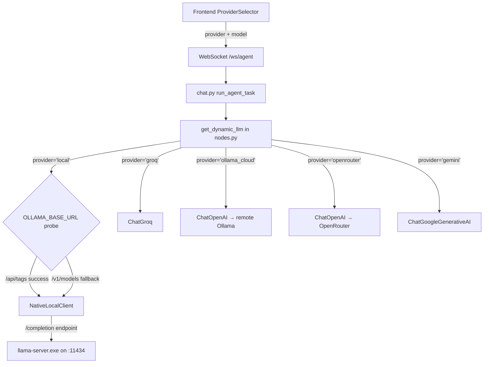

# 🧠 AICodex Local LLM Pipeline — Architecture Analysis & Recommendations

## My Take on Session 8

The conversation in `aicodex-session-8` was productive but the Ministral-3:8b model gave you some misleading information. Let me correct the record and then give you a proper roadmap.

### What the Session Got Wrong

1. **"Ollama — Actively maintained (Google-backed)"** — This is flat wrong. Ollama is **not** Google-backed. It's an independent open-source project. The model hallucinated this.
2. **"Llama.cpp — Slower updates (community-driven)"** — Also backwards. `llama.cpp` gets updated *multiple times per day* by ggerganov and a massive contributor base. Ollama literally *wraps* llama.cpp under the hood — it's built on top of it.
3. **"Ollama uses binary formats (e.g., `ggml` or `q4_0`)"** — Ollama uses **GGUF**, the same format as llama.cpp. They are the same engine underneath. The doc in `Ollama_App_vs_Llamacpp.md` carries these same errors.
4. **RotorQuant / TurboQuant** — These names don't correspond to any known widely-adopted quantization framework. Your `llama-cpp-turboquant` directory appears to just be a fork/build of standard `llama.cpp`. The real quantization methods you'd use are **GGUF quantization** via `llama-quantize` (e.g., Q4_K_M, Q5_K_M, IQ2_M) or **imatrix-calibrated** quantization.

### What the Session Got Right

The core *instinct* was correct:
- **Ollama** = convenience layer (pull-and-run, OpenAI-compatible API, manages model files)
- **llama.cpp `llama-server`** = raw performance layer (direct GGUF loading, cache tuning, `n_gpu_layers`, etc.)

---

## Current Architecture — What You Actually Have



### Key observations:

| Component | File | Current State |
|-----------|------|---------------|
| **Provider routing** | [nodes.py](file:///c:/AppDev/My_Linkdin/projects/iarxii/AI_Codex/backend/agent/nodes.py#L30-L139) | 5 providers, `local` always routes to `NativeLocalClient` |
| **Chat template** | [local_client.py](file:///c:/AppDev/My_Linkdin/projects/iarxii/AI_Codex/backend/agent/local_client.py#L20-L31) | **Hardcoded Llama-3 format** (`<\|begin_of_text\|>`, `<\|start_header_id\|>`, etc.) |
| **Model discovery** | [models.py](file:///c:/AppDev/My_Linkdin/projects/iarxii/AI_Codex/backend/api/models.py#L8-L52) | Probes `/api/tags` (Ollama) then `/v1/models` (OpenAI-compat) |
| **Server URL** | [.env](file:///c:/AppDev/My_Linkdin/projects/iarxii/AI_Codex/backend/.env) | Single `OLLAMA_BASE_URL=http://localhost:11434` |
| **Frontend providers** | [providerMeta.ts](file:///c:/AppDev/My_Linkdin/projects/iarxii/AI_Codex/client/src/components/providerMeta.ts) | `local` is labeled "Llama.cpp" with Ollama icon |

> [!IMPORTANT]
> **The critical blocker for multi-model support**: Your `NativeLocalClient` has a **hardcoded Llama-3 chat template**. If you load a Qwen or GLM model, it will receive Llama-3 tokens (`<|start_header_id|>`, `<|eot_id|>`) which will produce garbage output. Each model family needs its own template.

---

## Model Recommendations — The Honest Assessment

### ❌ Kimi K2 — Skip It for Local

| Spec | Value |
|------|-------|
| **Total params** | ~1 Trillion (MoE) |
| **Active params** | ~32B per token |
| **Minimum RAM** | 240GB+ even at 2-bit quant |
| **Disk** | Hundreds of GB |

This is a datacenter model. Even the most aggressive quantization won't fit in consumer hardware. It's brilliant on API, but for local inference? Unless you have a workstation with 256GB+ RAM and multiple GPUs, this is a non-starter. Use it via **OpenRouter** instead — you already have that provider wired up.

### ✅ Qwen3 / Qwen3.5 / Qwen3.6 — **Best Pick**

| Size | VRAM (Q4_K_M) | Quality | Speed (RTX 3060 12GB) | Tool Calling |
|------|---------------|---------|----------------------|--------------|
| **4B** | ~3GB | Good for coding/chat | 40+ tok/s | Partial |
| **8B** | ~5.5GB | Excellent | 25+ tok/s | Yes (ChatML native) |
| **14B** | ~9GB | Outstanding | 12+ tok/s | Yes |

**Why Qwen is ideal for your stack:**
- Uses **ChatML** format (`<|im_start|>`, `<|im_end|>`) — extremely well-supported in llama.cpp
- Has native **thinking mode** (`<think>` tags) you could wire into your Agent Canvas
- Supports **tool calling** natively in the instruction-tuned variants
- Available on both **Ollama** (`ollama pull qwen3:8b`) and **raw GGUF** for llama-server
- Alibaba is iterating rapidly — Qwen3.6 (April 2026) has major agentic improvements

### ✅ GLM-4 9B — Solid Secondary

| Size | VRAM (Q4_K_M) | Quality | Speed (RTX 3060 12GB) | Tool Calling |
|------|---------------|---------|----------------------|--------------|
| **9B** | ~5.5GB | Very good, strong on Chinese & reasoning | 20+ tok/s | Partial |

**Why GLM is a good second model:**
- Different training data distribution from Qwen — gives you **diversity of thought**
- Uses its own template (`[gMASK] <sop> <|system|>...`) — well-supported in llama.cpp's Jinja engine
- Available on Ollama (`ollama run glm4`)
- Zhipu/Tsinghua backing — strong research pedigree

---

## The Real Architecture Question: Ollama vs llama-server Toggle

Here's the fundamental truth about your current setup:

```
Ollama = llama.cpp + model management + OpenAI-compatible API wrapper + service daemon
```

They are **not** competing tools. They're **layers of the same stack**. Here's how to think about it:

| Feature | Ollama App | Raw llama-server |
|---------|-----------|-----------------|
| **Model management** | `ollama pull qwen3:8b` | Manual GGUF download |
| **API style** | OpenAI-compatible `/v1/chat/completions` | Native `/completion` + OpenAI `/v1/chat/completions` |
| **Chat template** | Auto-applied per model | You must specify `--jinja` or pass correct template |
| **Multi-model** | Switches on-the-fly | One model per server instance |
| **GPU layer control** | Limited (via Modelfile) | Full (`--n-gpu-layers`, `--tensor-split`) |
| **KV cache tuning** | None | `--cache-type-k q8_0`, slot management |
| **Quantization control** | Pre-baked quants from registry | Custom quant with `llama-quantize` |

### My Recommendation: Don't Frame It as Either/Or — Frame It as **Backend Mode**

```
┌─────────────────────────────────────────────────┐
│         Frontend: "Local Backend Mode"           │
│   ┌──────────────┐  ┌────────────────────────┐  │
│   │  🟢 Ollama   │  │  ⚡ Custom llama-server │  │
│   │  (Easy mode) │  │  (Performance mode)     │  │
│   └──────────────┘  └────────────────────────┘  │
│         Toggle in Settings / Sidebar             │
└─────────────────────────────────────────────────┘
```

### How This Maps to Code Changes

#### 1. Config: Two local endpoints instead of one

```python
# config.py — new settings
OLLAMA_BASE_URL: str = "http://localhost:11434"       # Ollama App
LLAMACPP_BASE_URL: str = "http://localhost:8080"      # llama-server.exe
LOCAL_BACKEND_MODE: str = "ollama"                     # "ollama" | "llamacpp"
```

#### 2. `NativeLocalClient` → Becomes a Template-Aware Client

The current `_apply_llama3_template()` hardcodes Llama-3 tokens. For multi-model support, you need a **template registry**:

```python
CHAT_TEMPLATES = {
    "llama3": {
        "bos": "<|begin_of_text|>",
        "header": "<|start_header_id|>{role}<|end_header_id|>\n\n",
        "eot": "<|eot_id|>",
        "stop": ["<|eot_id|>", "<|end_of_text|>", "<|start_header_id|>"]
    },
    "chatml": {  # Qwen, Yi, Mistral-Instruct-v0.3+
        "bos": "",
        "header": "<|im_start|>{role}\n",
        "eot": "<|im_end|>\n",
        "stop": ["<|im_end|>"]
    },
    "glm4": {
        "bos": "[gMASK]<sop>",
        "header": "<|{role}|>\n",
        "eot": "",
        "stop": ["<|user|>", "<|observation|>"]
    }
}
```

> [!TIP]
> **But here's the thing**: If you use **Ollama mode**, you don't need templates at all. Ollama's `/v1/chat/completions` endpoint handles templating internally based on the model's Modelfile. The template registry is only needed for **raw llama-server mode** where you hit the `/completion` endpoint with a raw prompt string.

#### 3. `get_dynamic_llm()` — Split the `local` path

```python
elif provider == "local":
    mode = config.get("configurable", {}).get("local_backend_mode", 
                                                settings.LOCAL_BACKEND_MODE)
    
    if mode == "ollama":
        # Use LangChain's ChatOpenAI against Ollama's OpenAI-compat API
        # Templates are handled by Ollama automatically
        base_url = settings.OLLAMA_BASE_URL + "/v1"
        return ChatOpenAI(model=model, base_url=base_url, api_key="ollama", ...)
    
    elif mode == "llamacpp":
        # Use NativeLocalClient with explicit template
        template_name = detect_template(model)  # sniff from model name
        return NativeLocalClient(
            base_url=settings.LLAMACPP_BASE_URL,
            model=model,
            template=template_name,
            temperature=temp
        )
```

#### 4. Frontend: Add backend mode toggle

In [ProviderSelector.tsx](file:///c:/AppDev/My_Linkdin/projects/iarxii/AI_Codex/client/src/components/ProviderSelector.tsx) or [Sidebar.tsx](file:///c:/AppDev/My_Linkdin/projects/iarxii/AI_Codex/client/src/components/Sidebar.tsx), add a toggle:

```
┌─────────────────────────────────┐
│ Local Backend                   │
│ ○ Ollama App (auto-template)    │
│ ● Custom llama-server (manual)  │
│                                 │
│ Server URL: http://localhost:8080│
└─────────────────────────────────┘
```

This toggle persists to `localStorage` as `local_backend_mode` and gets sent in the WebSocket payload alongside `provider`.

---

## Summary: What To Actually Do

### Phase 1: Multi-Model Foundation (Template Abstraction)
1. Refactor `NativeLocalClient` to accept a `template` parameter
2. Build a template registry (Llama-3, ChatML, GLM-4)
3. Add template auto-detection from model name (e.g., `qwen` → `chatml`, `glm` → `glm4`)

### Phase 2: Ollama/llama-server Toggle
1. Add `LLAMACPP_BASE_URL` and `LOCAL_BACKEND_MODE` to `config.py` / `.env`
2. Split the `local` path in `get_dynamic_llm()` into `ollama` and `llamacpp` sub-modes
3. In Ollama mode → use `ChatOpenAI` against `/v1/chat/completions` (no manual templates)
4. In llamacpp mode → use `NativeLocalClient` with template registry
5. Add frontend toggle to Settings/Sidebar

### Phase 3: Model Acquisition
1. **Qwen3.6 8B** — `ollama pull qwen3:8b` or download `Qwen3.6-8B-Instruct-Q4_K_M.gguf` from HuggingFace (bartowski)
2. **GLM-4 9B** — `ollama pull glm4` or download `glm-4-9b-chat-Q4_K_M.gguf` from HuggingFace (bartowski)
3. Both fit comfortably in 12GB VRAM at Q4_K_M

### What I'd Skip
- **Kimi K2** for local — use it through OpenRouter instead
- **Gemma models** — you mentioned wanting to avoid these, and I agree; Qwen and GLM are stronger at similar sizes for agentic/coding tasks
- **Over-engineering the quantization pipeline** — use pre-quantized GGUFs from HuggingFace rather than running `llama-quantize` yourself, unless you have specific calibration data

> [!NOTE]
> **The Ollama mode is the pragmatic default.** It handles template switching, model downloads, GPU layer allocation, and API compatibility for you. Reserve llama-server mode for when you need to squeeze out maximum performance from a single model with custom KV cache settings and slot management. Your `llama-cpp-turboquant` build is useful for that power-user scenario.
