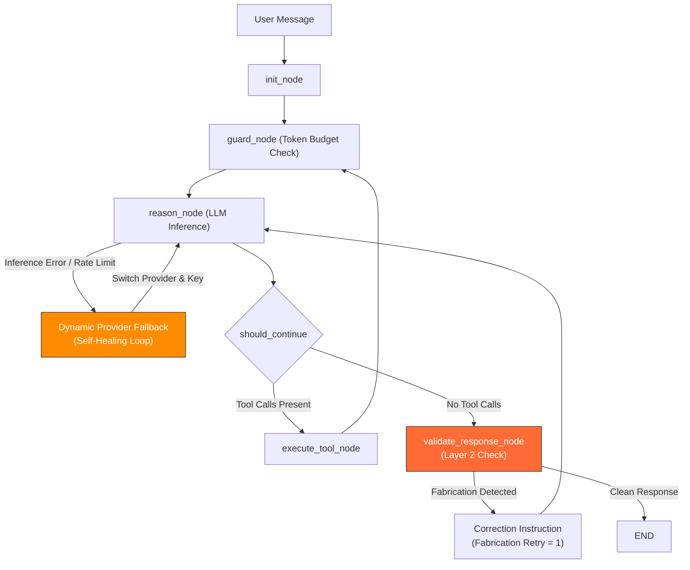

# Loop Engineering: Stateful Architecture in AICodex

## 1. What is Loop Engineering?

**Loop Engineering** represents a paradigm shift in AI system design. While **prompt engineering** focuses on optimizing the textual input to a model for a single reasoning step, **Loop Engineering** focuses on designing the stateful, autonomous, and self-healing systems ("loops") that govern how an AI agent interacts with its environment over multiple steps.

In a Loop-Engineered system, individual model outputs are not assumed to be correct or final. Instead, the architecture embeds:
- **State Persistence**: A central state registry tracking history, context, and retry counters.
- **Defensive Guards**: Validation layers that inspect inputs and outputs to block loop errors.
- **Self-Correction Cycles**: Automatic re-prompting loops that route failures back to the reasoning layer with corrective feedback.
- **Dynamic Failover**: Automated switches to alternative models or providers when execution environments degrade.

---

## 2. AICodex Loop Architecture

The AICodex platform uses **LangGraph** to implement a multi-layered ReAct (Reasoning + Action) execution loop. The core flow is governed by a stateful graph that dynamically routes processing based on model decisions and verification checks:

---

## 3. The 3-Layer Defense-in-Depth

To solve the inconsistency where the model claimed to perform file operations using UI Canvas blocks instead of executing mandatory filesystem tools, AICodex implements a three-layered loop:

### Layer 1: Instructional (Pre-Execution Guard)
- **Rules Mapping**: `AGENTS.md` and `profile.py` define strict **Tool-First Precedence Rules**.
- **Context Injection**: The LLM is explicitly trained via few-shot correct/incorrect examples that canvas blocks (`[CANVAS:...]`) are purely cosmetic and do not mutate files on disk.

### Layer 2: Graph Validator (Post-Execution Loop)
- **Validation Node**: The `validate_response_node` intercepts execution when the reasoning node finishes without calling tools.
- **Fabrication Detection**: If the model claims to have created files or executed terminal commands inside its response text but did not issue actual tool calls, the validator halts completion.
- **Correction Feedback**: A `SystemMessage` detailing the mistake is appended to the message history, routing the flow back to the `reason_node` for a retry.
- **Circuit Breaker**: A `fabrication_retries` counter is stored in the state, limiting self-correction to exactly one retry to prevent runaway API costs.

### Layer 3: Telemetry Injection (Observability)
- **Tool binding status** is resolved dynamically after credentials are checked and prior to prompting. The system prompt is assembled with a `"TOOL STATUS"` instruction confirming exactly which tools are bound, preventing model uncertainty regarding its capabilities.

---

## 4. Self-Healing Provider Fallback Loop

Under the Loop Engineering paradigm, network timeouts, API rate limits (HTTP 429), and quota exhaustions are treated as system faults to be bypassed automatically.

### Failover Execution Flow

1. **Failure Interception**: The `reason_node` executes LLM calls within a `try-except` wrapper.
2. **Limit/Overload Detection**: The exception is examined for signs of provider fatigue:
   - Rate limit status codes (`429`).
   - Quota exhaustion strings (`insufficient_quota`, `billing_limit`).
   - Timeout or server overload errors (`500`, `503`, `TimeoutError`).
3. **Fallback Resolution**: A hierarchical lookup resolves the next best provider where credentials exist (Groq ➔ Gemini ➔ OpenRouter ➔ Local Ollama).
4. **Transparent Switch & Stream**: The system logs the change, pushes an advisory notice (e.g. `⚠️ [GROQ] rate limit reached. Switching to [GEMINI] fallback...`) directly to the client's WebSocket stream, re-binds tools to the fallback model, and automatically retries the inference.

---

## 5. Token and Context Budgeting

Loop Engineering requires strict budget controls. If retry cycles copy the entire context history, token usage escalates. AICodex mitigates this using two strategies:
- **State Truncation**: When the validator node triggers a retry, the content of the fabricated AI response is truncated in the message history, leaving a minimal placeholder. This prevents returning large, useless code blocks back to the model as input tokens on the retry turn.
- **Guard Node Budgeting**: Before entering the reasoning loop, the `guard_node` verifies that the active context does not exceed the token capacity of the model, summarizing or sliding the context window if necessary.
