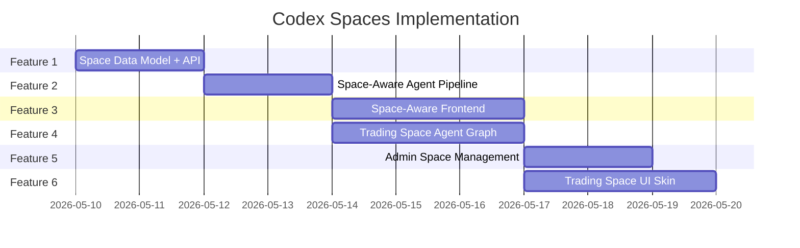

# Codex Spaces: Curated Agentic Workspaces for AI_Codex

> **Scope**: Extend AI_Codex from a single-purpose agentic chat into a **multi-space platform** where each "Codex Space" is a curated workspace with its own specialized agent graph, skill set, system prompt persona, UI skin, and access control.

## User Review Required

> [!IMPORTANT]
> **Access Model Decision**: The plan proposes a role-based access system using the existing `role` field on `User` plus a new `CodexSpaceAccess` join table. This means space access is managed per-user by admins. Is this acceptable, or do you envision an invite-code / subscription-tier model instead?

> [!IMPORTANT]
> **First Space**: The plan uses the **Financial Trading Space** as the first concrete Codex Space implementation (based on the NotebookLM research). Should we also scaffold a second space type (e.g., "Code Lab" for the current general-purpose agent) to validate the abstraction, or focus purely on Trading Space first?

> [!WARNING]
> **Breaking Change**: The `Conversation` model will gain a `space_type` column. Existing conversations will default to `"general"`. The frontend sidebar will be refactored to show space-grouped conversations. This is a schema migration.

## Open Questions

1. **Space-Specific API Keys**: Should each Codex Space support its own set of provider API keys (e.g., a Trading Space might need a market data API key), or inherit the user's global BYOK keys?
2. **Space Capacity**: Should spaces have user limits (e.g., max 50 users in Trading Space beta)?
3. **Space Persistence**: When a user loses access to a space, should their conversation history in that space be preserved (read-only) or archived?

---

## Proposed Changes

The implementation is divided into **6 Features**, executed sequentially. Each feature is self-contained and deployable.

---

### Feature 1: Space Registry & Data Model

**Goal**: Establish the foundational database schema and backend registry for Codex Spaces.

#### [MODIFY] [models.py](file:///c:/AppDev/My_Linkdin/projects/iarxii/AI_Codex/backend/db/models.py)

Add two new models:

```python
class CodexSpace(Base):
    __tablename__ = "codex_spaces"
    
    id: Mapped[int] = mapped_column(primary_key=True)
    slug: Mapped[str] = mapped_column(String(50), unique=True, index=True)  # "trading-space", "code-lab"
    name: Mapped[str] = mapped_column(String(100))  # "Financial Trading Space"
    description: Mapped[str] = mapped_column(Text)
    icon: Mapped[Optional[str]] = mapped_column(String(50))  # Heroicon name or emoji
    color: Mapped[Optional[str]] = mapped_column(String(20))  # Accent color hex
    is_active: Mapped[bool] = mapped_column(default=True)
    is_public: Mapped[bool] = mapped_column(default=False)  # Public spaces don't need access grants
    required_role: Mapped[str] = mapped_column(String(20), default="user")  # Minimum role required
    config_json: Mapped[Optional[str]] = mapped_column(Text)  # Space-specific config (agent graph, skills, system prompt)
    created_at: Mapped[datetime] = mapped_column(DateTime, default=datetime.utcnow)

class CodexSpaceAccess(Base):
    __tablename__ = "codex_space_access"
    
    id: Mapped[int] = mapped_column(primary_key=True)
    user_id: Mapped[int] = mapped_column(ForeignKey("users.id"), index=True)
    space_id: Mapped[int] = mapped_column(ForeignKey("codex_spaces.id"), index=True)
    granted_at: Mapped[datetime] = mapped_column(DateTime, default=datetime.utcnow)
    granted_by: Mapped[Optional[int]] = mapped_column(ForeignKey("users.id"))
```

Modify the existing `Conversation` model to add:
```python
space_type: Mapped[str] = mapped_column(String(50), default="general", index=True)
```

#### [NEW] [spaces.py](file:///c:/AppDev/My_Linkdin/projects/iarxii/AI_Codex/backend/api/spaces.py)

New API router with endpoints:
- `GET /spaces/` — List all spaces the current user has access to
- `GET /spaces/{slug}` — Get space details + config
- `POST /spaces/{slug}/conversations` — Create a conversation in a specific space
- `GET /spaces/{slug}/conversations` — List conversations in a space

#### [MODIFY] [main.py](file:///c:/AppDev/My_Linkdin/projects/iarxii/AI_Codex/backend/main.py)

Register the new `spaces` router.

#### [MODIFY] [session.py](file:///c:/AppDev/My_Linkdin/projects/iarxii/AI_Codex/backend/db/session.py)

Add migration logic for new tables (`codex_spaces`, `codex_space_access`) and the `space_type` column on `conversations`.

**Tasks:**
- [ ] Add `CodexSpace` and `CodexSpaceAccess` models
- [ ] Add `space_type` column to `Conversation`
- [ ] Create `spaces.py` API router with CRUD + access-check middleware
- [ ] Register router in `main.py`
- [ ] Add auto-migration for new tables/columns in `session.py`
- [ ] Seed the "General" space (public, default) and "Financial Trading Space" (private, requires access)
- [ ] Write space access validation helper: `async def check_space_access(user, space_slug, db)`

---

### Feature 2: Space-Aware Agent Pipeline

**Goal**: Route conversations through space-specific agent configurations (system prompts, skill subsets, graph variants).

#### [NEW] [space_config.py](file:///c:/AppDev/My_Linkdin/projects/iarxii/AI_Codex/backend/agent/space_config.py)

A registry that maps `space_type` → agent configuration:

```python
SPACE_CONFIGS = {
    "general": {
        "system_prompt_prefix": "",  # Uses default profile-based prompt
        "graph_type": "default",     # init → reason → execute_tool
        "skills": ["all"],           # Full skill set
        "constraints": {}
    },
    "trading-space": {
        "system_prompt_prefix": TRADING_SPACE_SYSTEM_PROMPT,
        "graph_type": "trading",     # init → market_analysis → debate → resolve → execute
        "skills": ["memory_skill", "url_reader", "github_search"],  # Curated subset
        "constraints": {
            "max_rounds": 3,         # Bull/Bear debate rounds
            "require_confirmation": True  # Human-in-the-loop for trade signals
        }
    }
}
```

#### [MODIFY] [chat.py](file:///c:/AppDev/My_Linkdin/projects/iarxii/AI_Codex/backend/api/chat.py)

- Accept `space_type` in the WebSocket payload
- Validate the user has access to that space before processing
- Pass `space_type` through `RunnableConfig` to the agent graph
- Select the correct graph variant based on `space_type`

#### [MODIFY] [graph.py](file:///c:/AppDev/My_Linkdin/projects/iarxii/AI_Codex/backend/agent/graph.py)

- Add a `create_agent_graph(space_type="general")` parameter
- For `"general"`: existing `init → reason → execute_tool` loop
- For `"trading"`: extended graph with debate nodes (scaffolded, full implementation in Feature 4)

#### [MODIFY] [nodes.py](file:///c:/AppDev/My_Linkdin/projects/iarxii/AI_Codex/backend/agent/nodes.py)

- Modify `init_node` to read `space_type` from config and apply the space-specific system prompt prefix
- Modify tool binding in `reason_node` to filter skills based on space config

**Tasks:**
- [ ] Create `space_config.py` with `SPACE_CONFIGS` registry and `get_space_config(space_type)` function
- [ ] Write `TRADING_SPACE_SYSTEM_PROMPT` with domain-specific persona, constraints, and output format
- [ ] Modify `chat.py` WebSocket handler to accept and validate `space_type`
- [ ] Parameterize `create_agent_graph()` to accept `space_type`
- [ ] Add space-aware system prompt injection in `init_node`
- [ ] Add space-aware skill filtering in `reason_node`
- [ ] Add space access validation in WebSocket connection flow

---

### Feature 3: Space-Aware Frontend

**Goal**: Transform the sidebar into a space navigator and scope conversations to spaces.

#### [MODIFY] [Sidebar.tsx](file:///c:/AppDev/My_Linkdin/projects/iarxii/AI_Codex/client/src/components/Sidebar.tsx)

- Add a "Space Selector" section above the conversation list
- Show accessible spaces with icons and accent colors
- Group conversations by active space
- Show a 🔒 indicator on locked spaces the user doesn't have access to
- Active space selection changes the conversation list filter and the "New Workspace" button behavior

#### [MODIFY] [Chat.tsx](file:///c:/AppDev/My_Linkdin/projects/iarxii/AI_Codex/client/src/pages/Chat.tsx)

- Pass `space_type` when creating conversations and sending WebSocket messages
- Show space-specific header/branding in the chat area
- Space-specific accent color theming

#### [MODIFY] [AIContext.tsx](file:///c:/AppDev/My_Linkdin/projects/iarxii/AI_Codex/client/src/contexts/AIContext.tsx)

- Add `activeSpace` state (slug of selected space)
- Add `spaces` state (list of accessible spaces fetched from API)
- Add `setActiveSpace(slug)` action
- Add `fetchSpaces()` on mount

#### [NEW] [SpaceCard.tsx](file:///c:/AppDev/My_Linkdin/projects/iarxii/AI_Codex/client/src/components/SpaceCard.tsx)

A visual card component for space selection in the sidebar:
- Space icon + name
- Active indicator glow
- Lock icon for inaccessible spaces
- Conversation count badge

**Tasks:**
- [ ] Add `activeSpace`, `spaces[]`, `setActiveSpace()`, `fetchSpaces()` to `AIContext.tsx`
- [ ] Create `SpaceCard.tsx` component with space icon, name, lock indicator, and count badge
- [ ] Refactor `Sidebar.tsx` to add Space Selector section above conversation list
- [ ] Filter conversations by `activeSpace` in sidebar
- [ ] Pass `space_type` in "New Workspace" creation flow
- [ ] Pass `space_type` in WebSocket `payload` when sending messages in `Chat.tsx`
- [ ] Add space-specific header bar in Chat view showing space name + accent color
- [ ] Add "Request Access" button UX for locked spaces (opens a modal or sends a notification)

---

### Feature 4: Financial Trading Space — Agent Graph

**Goal**: Implement the specialized multi-node LangGraph for the Trading Space, based on the TradingAgents research paper.

#### [NEW] [trading_nodes.py](file:///c:/AppDev/My_Linkdin/projects/iarxii/AI_Codex/backend/agent/trading_nodes.py)

New node functions for the Trading Space graph:

```
market_analysis_node  → Retrieves market context (stub: user-provided data initially)
bull_researcher_node  → Generates bullish analysis with citations
bear_researcher_node  → Generates bearish counter-analysis
debate_facilitator_node → Synthesizes debate into a signal or "No Trade"
```

Each node receives `AgentState` with an extended `trading_context` field:
```python
{
    "market_data": {},        # Price, volume, indicators
    "bull_argument": "",      # Bull's case
    "bear_argument": "",      # Bear's counter-case
    "debate_round": 0,        # Current round (max from config)
    "signal": None,           # Final: "BUY" | "SELL" | "HOLD" | None
    "confidence": 0.0,        # 0.0–1.0
    "rationale": ""           # Human-readable summary
}
```

#### [MODIFY] [state.py](file:///c:/AppDev/My_Linkdin/projects/iarxii/AI_Codex/backend/agent/state.py)

Add `trading_context: dict` to `AgentState` (optional, defaults to `{}`).

#### [MODIFY] [graph.py](file:///c:/AppDev/My_Linkdin/projects/iarxii/AI_Codex/backend/agent/graph.py)

Add the `"trading"` graph variant:
```
init → market_analysis → bull_researcher → bear_researcher 
                                    ↕ (n rounds via conditional edge)
                              debate_facilitator → reason → [tool_call | END]
```

**Tasks:**
- [ ] Create `trading_nodes.py` with 4 node functions (market_analysis, bull, bear, facilitator)
- [ ] Add `trading_context` to `AgentState`
- [ ] Write Bull Researcher system prompt with optimistic analysis persona
- [ ] Write Bear Researcher system prompt with skeptical/contrarian persona
- [ ] Write Debate Facilitator prompt that synthesizes opposing arguments into a deterministic signal
- [ ] Implement debate round counting with conditional edges (`should_continue_debate`)
- [ ] Add `"trading"` variant to `create_agent_graph()`
- [ ] Add structured output format for trade signals (JSON schema validation)
- [ ] Implement `market_analysis_node` as a stub that accepts user-supplied context (no live data yet)
- [ ] Stream debate progress to the frontend via existing WebSocket `status` messages

---

### Feature 5: Admin Space Management

**Goal**: Allow admins to manage spaces and user access from the Admin Dashboard.

#### [MODIFY] [admin.py](file:///c:/AppDev/My_Linkdin/projects/iarxii/AI_Codex/backend/api/admin.py)

Add endpoints:
- `GET /admin/spaces` — List all spaces
- `POST /admin/spaces` — Create a new space
- `PATCH /admin/spaces/{space_id}` — Update space config
- `GET /admin/spaces/{space_id}/users` — List users with access
- `POST /admin/spaces/{space_id}/grant` — Grant user access (body: `{ user_id }`)
- `DELETE /admin/spaces/{space_id}/revoke/{user_id}` — Revoke user access

#### [MODIFY] [AdminDashboard.tsx](file:///c:/AppDev/My_Linkdin/projects/iarxii/AI_Codex/client/src/pages/AdminDashboard.tsx)

Add a "Space Management" tab:
- Space list with toggle (active/inactive)
- User access management per space (grant/revoke)
- Space configuration editor (JSON config for advanced settings)

**Tasks:**
- [ ] Add space CRUD endpoints to `admin.py`
- [ ] Add grant/revoke access endpoints to `admin.py`
- [ ] Add "Space Management" tab to `AdminDashboard.tsx`
- [ ] Build space list view with active/inactive toggles
- [ ] Build user access management UI (search user → grant access)
- [ ] Build space config editor (JSON textarea with validation)

---

### Feature 6: Trading Space UI Skin

**Goal**: Create a visually differentiated experience for the Financial Trading Space.

#### [NEW] [TradingSpaceHeader.tsx](file:///c:/AppDev/My_Linkdin/projects/iarxii/AI_Codex/client/src/components/rooms/TradingSpaceHeader.tsx)

A space-specific header component showing:
- Space name with financial icon
- Active debate status indicator (Bull 🟢 vs Bear 🔴)
- Signal output display (BUY/SELL/HOLD badge with confidence %)

#### [NEW] [DebatePanel.tsx](file:///c:/AppDev/My_Linkdin/projects/iarxii/AI_Codex/client/src/components/rooms/DebatePanel.tsx)

A split-panel component showing Bull vs Bear arguments side-by-side during debate rounds. Rendered from `trading_context` state sent via WebSocket.

#### [NEW] [SignalCard.tsx](file:///c:/AppDev/My_Linkdin/projects/iarxii/AI_Codex/client/src/components/rooms/SignalCard.tsx)

A card component displaying the final trade signal with:
- Direction badge (BUY green / SELL red / HOLD amber)
- Confidence meter
- Rationale summary
- "Approve" / "Reject" buttons (human-in-the-loop)

#### [MODIFY] [Chat.tsx](file:///c:/AppDev/My_Linkdin/projects/iarxii/AI_Codex/client/src/pages/Chat.tsx)

Conditionally render space-specific components based on `activeSpace`:
- `"trading-space"` → `TradingSpaceHeader`, `DebatePanel`, `SignalCard`
- `"general"` → Current default layout

#### [NEW] [spaces.css](file:///c:/AppDev/My_Linkdin/projects/iarxii/AI_Codex/client/src/components/rooms/spaces.css)

Space-specific CSS variables and styles:
- Trading Space: dark theme with financial green/red accent colors
- Debate panel split layout
- Signal card animations

**Tasks:**
- [ ] Create `components/rooms/` directory structure
- [ ] Build `TradingSpaceHeader.tsx` with debate status + signal display
- [ ] Build `DebatePanel.tsx` with Bull/Bear split-view
- [ ] Build `SignalCard.tsx` with signal badge + approval buttons
- [ ] Create `spaces.css` with Trading Space theme variables
- [ ] Add conditional space component rendering in `Chat.tsx`
- [ ] Handle `trading_context` data from WebSocket events in the frontend
- [ ] Add approve/reject WebSocket commands for human-in-the-loop signals

---

## Execution Sequence



> Features 3 and 4 can be developed in parallel after Feature 2.

---

## Verification Plan

### Automated Tests
- Backend: Create `test_spaces.py` — verify space CRUD, access grants, and conversation scoping
- Backend: Create `test_trading_graph.py` — verify the trading graph executes debate rounds and produces structured signals
- Frontend: Verify space selector renders, conversations filter by space, and WebSocket payloads include `space_type`

### Manual Verification
1. **Space Access Flow**: Register a new user → verify they see "General" but NOT "Trading Space" → admin grants access → verify "Trading Space" appears
2. **Trading Space Agent**: Open Trading Space → send a market analysis prompt → verify Bull/Bear debate streams → verify signal output renders
3. **Admin Dashboard**: Navigate to admin → create a new space → grant/revoke user access → verify changes reflect in user's sidebar
4. **Cloud Run Deployment**: Deploy and verify the schema migration runs without data loss on existing conversations

---

## File Summary

| Action | File | Feature |
|:-------|:-----|:--------|
| MODIFY | `backend/db/models.py` | F1 |
| MODIFY | `backend/db/session.py` | F1 |
| NEW | `backend/api/spaces.py` | F1 |
| MODIFY | `backend/main.py` | F1 |
| NEW | `backend/agent/space_config.py` | F2 |
| MODIFY | `backend/api/chat.py` | F2 |
| MODIFY | `backend/agent/graph.py` | F2, F4 |
| MODIFY | `backend/agent/nodes.py` | F2 |
| MODIFY | `backend/agent/state.py` | F4 |
| NEW | `backend/agent/trading_nodes.py` | F4 |
| MODIFY | `client/src/contexts/AIContext.tsx` | F3 |
| MODIFY | `client/src/components/Sidebar.tsx` | F3 |
| NEW | `client/src/components/SpaceCard.tsx` | F3 |
| MODIFY | `client/src/pages/Chat.tsx` | F3, F6 |
| MODIFY | `backend/api/admin.py` | F5 |
| MODIFY | `client/src/pages/AdminDashboard.tsx` | F5 |
| NEW | `client/src/components/rooms/TradingSpaceHeader.tsx` | F6 |
| NEW | `client/src/components/rooms/DebatePanel.tsx" | F6 |
| NEW | `client/src/components/rooms/SignalCard.tsx` | F6 |
| NEW | `client/src/components/rooms/spaces.css` | F6 |
