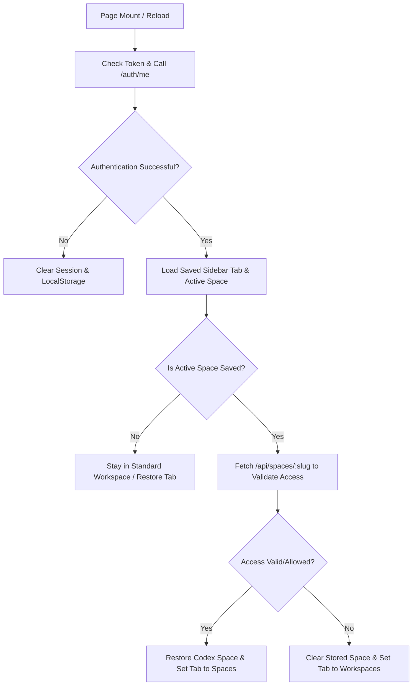

# Implementation Plan: Workspace & Spaces Persistence and Validation

This plan outlines the design and implementation to persist and restore the user's last-visited workspace state (Standard vs. Codex Spaces) and validate access on session startup or page reload.

## Proposed Behavior

## Key Tasks

### 1. State Persistence via LocalStorage
* **Sidebar Tab State**: Keep track of the active tab (`'workspaces'` vs. `'spaces'`) using the `ai_sidebar_tab` key in `localStorage`.
* **State Synchronization**:
  * Save the active tab selection on every manual switch in the Sidebar.
  * When a Codex Space is selected from the spaces catalog, automatically sync the sidebar tab state to `'spaces'`.

### 2. Active Space Server-Side Validation on Startup
* **Integrate with `refreshProfile`**: When the client app performs the startup handshake (`/api/auth/me`), if a saved active space is present in `localStorage`, trigger a validation request to:
  `GET /api/spaces/{slug}`
* **Enforce Permissions**:
  * If the response is successful (200 OK), the user retains access. Restore the space layout and drop them directly back into it.
  * If the request fails (403 Forbidden, 401 Unauthorized, or 404 Not Found), immediately clear `ai_active_space` from context and reset the sidebar tab to `'workspaces'`.

---

## Files to Modify

1. **[AIContext.tsx](file:///c:/AppDev/My_Linkdin/projects/iarxii/AI_Codex/client/src/contexts/AIContext.tsx)**:
   * Update `updateActiveSpace` to set `ai_sidebar_tab` to `'spaces'` when a non-null space is selected.
   * Update `refreshProfile` to call `GET /api/spaces/{slug}` to validate the saved space, fallback to standard workspace if unauthorized.
2. **[Sidebar.tsx](file:///c:/AppDev/My_Linkdin/projects/iarxii/AI_Codex/client/src/components/Sidebar.tsx)**:
   * Initialize `activeTab` state from `localStorage.getItem('ai_sidebar_tab')`.
   * Add a `useEffect` to save `activeTab` to `localStorage` whenever it changes.
   * Add a `useEffect` to sync `activeTab` to `'spaces'` if `activeSpace` becomes non-null.
