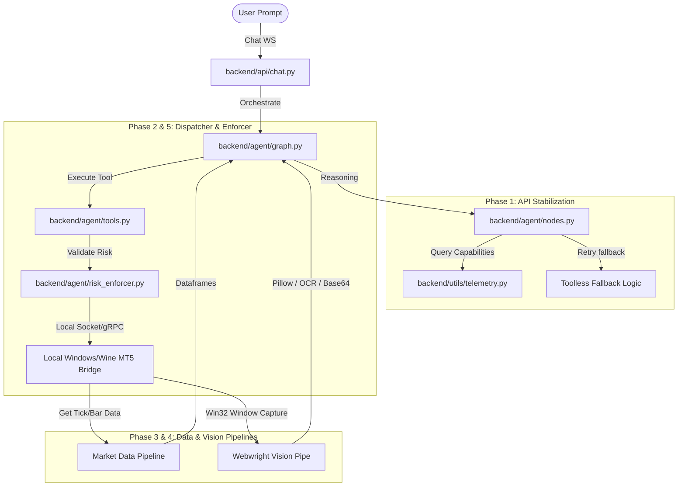

# Implementation Plan: API Stabilization & MT5 Execution Integration

This document outlines the detailed technical steps required to stabilize the AI agent's API connectivity and build the real-world execution bridges to the local MetaTrader 5 (MT5) workspace.

***

## Overview of the Architecture



***

## Phase 1: API Stabilization (Resolving API Failures)

### Task 1.1: Telemetry Model Filtering (Completed)
* **Goal:** Prevent the orchestrator from binding tools to provider models that reject them (such as Groq's speculative compound models).
* **Action:** Modified `backend/utils/telemetry.py` to identify if the provider is `groq` and the model name contains `"compound"`, stripping the `"Tools"` capability from the model's telemetry list.

### Task 1.2: Fallback Message Integrity (Completed)
* **Goal:** Prevent fallback retry errors from being swallowed by the original exception string.
* **Action:** Patched `backend/agent/nodes.py` to accurately capture and report fallback exception details to the user/UI when a retry fails.

### Task 1.3: Rate-Limit (429) Resiliency and Backoff
* **Goal:** Prevent rate limit crashes (e.g., Gemini 429) from terminating the graph session.
* **Action Steps:**
  1. Add exponential backoff to `get_dynamic_llm` calls.
  2. Implement an automatic sleep/retry loop (up to 3 attempts) specifically for `429` status codes in the request wrappers.
  3. Update `nodes.py` to return a friendly suggestion in the UI (e.g., `"The provider is overloaded. We recommend switching to groq/llama-3.3-70b-versatile in the Neuro panel."`).

***

## Phase 2: The Function Dispatcher (The Handshake)

### Task 2.1: Establish Local Communication Bridge
* **Goal:** Let the python backend interact with the MT5 container running in a Windows/Docker Wine sandbox.
* **Action Steps:**
  1. Create a lightweight socket server inside `backend/integrations/mt5_server.py`.
  2. Use JSON-RPC over TCP (port `8080` or unix sockets) for communication.
  3. Ensure a heartbeat check is performed when the agent starts to confirm if the bridge is connected.

### Task 2.2: Map Agent Tools to Live Code
Update the tool wrappers in `backend/agent/tools.py`:
* **`get_terminal_viewport`:** Triggers a window capture command on the host.
* **`mt5_dispatch_signal`:** Formats trade commands into structured JSON and passes them to the Risk Enforcer.

```python
# Prototype for mt5_dispatch_signal execution
async def mt5_dispatch_signal(symbol: str, tp: float, sl: float, entry: float, direction: str) -> str:
    # 1. Inspect risk parameters using local enforcer
    is_safe, reason = risk_enforcer.validate_trade(symbol, tp, sl, entry, direction)
    if not is_safe:
        return f"ORDER REJECTED BY RISK ENFORCER: {reason}"
        
    # 2. Dispatch to MT5 Server
    try:
        response = await mt5_client.send_command({
            "action": "trade",
            "symbol": symbol,
            "direction": direction,
            "entry": entry,
            "tp": tp,
            "sl": sl
        })
        return f"MT5_DISPATCH [{direction.upper()}] Success. Ticket: {response['ticket']}"
    except Exception as e:
        return f"MT5_DISPATCH ERROR: Connection to terminal lost - {str(e)}"
```

***

## Phase 3: Real-Time Market Data Pipeline

### Task 3.1: Unified Market Data Manager
* **Goal:** Merge external feeds (Yahoo Finance/OANDA) and active MT5 terminal states.
* **Action Steps:**
  1. Create `backend/integrations/market_pipeline.py`.
  2. Implement a `MarketPipeline` class that polls the MT5 server every 1 second for active symbol quotes (`SymbolInfoTick`).
  3. Feed live prices to the React frontend WebSocket connection via the existing `/api/market/ws` endpoint.
  4. Cache the historical candle state locally in SQLite/Qdrant to reduce latency.

***

## Phase 4: Webwright Vision Integration

### Task 4.1: Screen Capture Pipeline
* **Goal:** Capture the visual state of the trading charts and expose it to the multimodal LLM context.
* **Action Steps:**
  1. Create a screenshot utility `backend/utils/screenshot.py`.
  2. On Windows, use `win32gui` and `win32ui` to capture the specific MT5 window handle (`MetaTrader 5`). On headless Linux/Docker, capture the virtual framebuffer (`Xvfb`).
  3. Compress the image to standard size (e.g. `1024x1024` WebP) and save it under the `artifacts` directory.

### Task 4.2: Multimodal Visual Prompting
* **Action Steps:**
  1. If the selected model supports the `Multimodal` capability (e.g., Gemini or GPT-4o), format the screenshot as a base64 message and append it to the context.
  2. If the model does not support multimodal inputs, pass the screenshot through a local OCR script (or lightweight local vision server) and supply the text bounding boxes (prices, indicator text, current levels) to the model.

***

## Phase 5: Safety Guardrails (The Enforcer)

### Task 5.1: Create `risk_enforcer.py`
* **Goal:** Validate risk rules locally before any order reaches the broker.
* **Action Steps:**
  1. Create `backend/agent/risk_enforcer.py` defining the `RiskEnforcer` class.
  2. Read configuration rules from `backend/config.py` (e.g., `MAX_LOT_SIZE = 1.0`, `MAX_DAILY_DRAWDOWN_PCT = 2.0`, `STOPLOSS_REQUIRED = True`).
  3. Implement risk calculation:
     * Check current account balance and open exposure.
     * Reject trades missing a stop loss (`sl == 0`).
     * Check if the proposed lot size exceeds maximum bounds.
     * Verify that the direction matches standard market conventions.

***

## Timeline and Action Items

| Task | Priority | Complexity | Target File | Status |
| :--- | :--- | :--- | :--- | :--- |
| **Telemetry & Nodes Fix** | Critical | Low | `telemetry.py` / `nodes.py` | **Complete** |
| **Risk Enforcer Class** | High | Medium | `backend/agent/risk_enforcer.py` | Planned |
| **MT5 TCP Socket Bridge** | High | High | `backend/integrations/mt5_server.py` | Planned |
| **Market Data Pipeline** | Medium | Medium | `backend/integrations/market_pipeline.py` | Planned |
| **Vision Window Capturer** | Low | High | `backend/utils/screenshot.py` | Planned |
