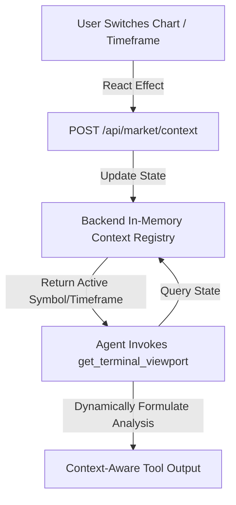

# Implementation Plan: Symbol Expansion & Global Context Management

This plan details the design and implementation to eliminate hardcoded rules in agent tools by introducing a dynamic active context registry on the backend, and expanding the asset class lists across the application.

***

## Proposed Context Management Flow



***

## Tasks and Changes

### 1. Dynamic Context Management (Backend)
* **Active State Storage**: In `backend/api/market.py`, implement an in-memory dictionary `active_context` protecting access via a threading Lock:
  ```python
  active_context = {
      "symbol": "BTCUSD",
      "timeframe": "H1",
      "indicator_state": "Neutral"
  }
  ```
* **fastAPI Router Additions**:
  * `POST /api/market/context`: Set symbol, timeframe, etc.
  * `GET /api/market/context`: Fetch current symbol and timeframe.
* **Agent Tools Refactoring (`backend/agent/tools.py`)**:
  * Read from `active_context` inside `get_terminal_viewport` to dynamically state: `"Terminal Viewport: {symbol} on {timeframe} active. Chart pattern is currently compiling."`
  * Use the dynamic symbol and entry price within `mt5_dispatch_signal` as default parameters if the LLM omits details.

### 2. Symbol Registry Expansion (Backend)
Update `SYMBOL_MAP` and `FALLBACK_BASE_PRICES` inside `backend/api/market.py` to support:
* **Cryptocurrencies**: BTCUSD, ETHUSD, XRPUSD (add).
* **Forex**: EURUSD, GBPUSD, ZARUSD (add).
* **US M7 Stocks**: TSLA, AAPL, MSFT (add), GOOGL (add), META (add), NVDA (add), AMZN (add).
* **Commodities**: XAUUSD, USOIL, BRENT (add), NATGAS (add).
* **ETFs / Indices**: SPX500, STX40 (add).

```python
SYMBOL_MAP = {
    # Cryptocurrencies
    "BTCUSD": "BTC-USD",
    "ETHUSD": "ETH-USD",
    "XRPUSD": "XRP-USD",
    # Forex
    "EURUSD": "EURUSD=X",
    "GBPUSD": "GBPUSD=X",
    "ZARUSD": "USDZAR=X", # Standard Quote pair
    # US M7 Stocks
    "TSLA": "TSLA",
    "AAPL": "AAPL",
    "MSFT": "MSFT",
    "GOOGL": "GOOGL",
    "META": "META",
    "NVDA": "NVDA",
    "AMZN": "AMZN",
    # Commodities
    "XAUUSD": "GC=F",
    "USOIL": "CL=F",
    "BRENT": "BZ=F",
    "NATGAS": "NG=F",
    # ETFs / Indices
    "SPX500": "^GSPC",
    "STX40": "^J200.JO",
}
```

### 3. Frontend Whitelist & Lists Expansion
* **`DisciplineContext.tsx`**: Update `allowedSymbolsWhitelist` to include all 19 expanded symbols.
* **`TradingChart.tsx`**:
  * Rename `Equities` category to `US M7 Stocks`.
  * Rename `Indices` category to `ETFs / Indices`.
  * Populate `INSTRUMENTS` array with all the new symbols, names, and base prices.
  * Add a `useEffect` that calls `POST /api/market/context` whenever `selectedSymbol` or `range` changes to keep the backend updated on what the user is inspecting.
* **`TradingSpaceHeader.tsx`**:
  * Expand `ASSETS` array to include the new assets in the scrolling ticker tape.
