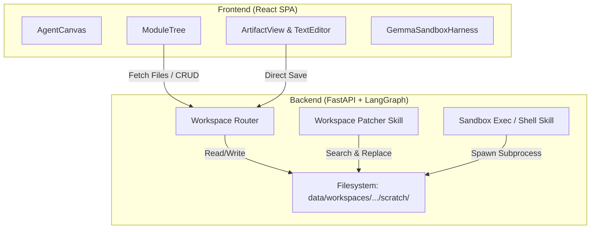

# Implementation Plan - Modernizing Agentic Canvas into an IDE-Style Component

This document outlines the design and step-by-step execution plan to evolve the Agent Canvas into a robust, stateful, and interactive IDE-style workspace.

---

## User Review Required

> [!IMPORTANT]
> **Key Architecture Decisions:**
> 1. **Server-Side File Synchronization**: The file tree will be backed by actual files on the server (`data/workspaces/{conversation_id}/scratch/`) rather than solely relying on parsed text artifacts from the chat stream.
> 2. **WebSocket & REST Alignment**: File operations (Create, Rename, Delete, Direct Edit) will use REST APIs, while agent updates (via `workspace_writer` and `workspace_patcher`) will automatically trigger a frontend reload of the workspace file tree.
> 3. **Process-Controlled Sandbox**: We will implement a process tracker in `sandbox.py` to allow clean termination of running deployment scripts and capture output for self-correction.

---

## Proposed Changes

---

## Detailed Components

### 1. Workspace API Endpoints
We will extend `backend/api/workspace.py` to expose REST endpoints for workspace filesystem CRUD operations.

#### [MODIFY] [workspace.py](file:///c:/AppDev/My_Linkdin/projects/iarxii/AI_Codex/backend/api/workspace.py)
* Add the following endpoints:
  - `GET /api/workspace/{conversation_id}/files`: Recursively lists all files and subfolders under the conversation's scratchpad directory. Returns metadata (path, name, size, type, language) and content.
  - `POST /api/workspace/{conversation_id}/file`: Creates or updates a file at the specified relative path.
  - `POST /api/workspace/{conversation_id}/folder`: Creates a folder (directory) at the specified relative path.
  - `POST /api/workspace/{conversation_id}/delete`: Deletes a file or directory recursively.
  - `POST /api/workspace/{conversation_id}/stop-process`: Aborts any running sandbox process for this conversation.

---

### 2. File Patcher Skill & Client Tool Binding
We will implement the search-and-replace patching logic in `workspace_patcher.py` and bind filesystem tools for `web` clients so they run server-side.

#### [MODIFY] [workspace_patcher.py](file:///c:/AppDev/My_Linkdin/projects/iarxii/AI_Codex/backend/skills/builtin/workspace_patcher.py)
* Read the file content from the workspace scratchpad.
* Verify that the `search_string` exists exactly **once** to ensure a unique patch target. If not, return a clear error.
* Replace the target block with `replace_string` and write the file back.
* Return a concise success message (to save context tokens) and return metadata/content in the SkillResult.

#### [MODIFY] [tools.py](file:///c:/AppDev/My_Linkdin/projects/iarxii/AI_Codex/backend/agent/tools.py)
* Update the client capability mapping to allow `workspace_writer`, `workspace_patcher`, `workspace_reader`, and `shell_exec` for the `web` client (executing server-side in the scratchpad folder).

---

### 3. Stateful IDE Canvas & Folder Management UI
We will upgrade `ModuleTree.tsx` to handle hierarchical operations, integrate a robust file creator, and add direct-edit capability inside `ArtifactView.tsx`.

#### [MODIFY] [ModuleTree.tsx](file:///c:/AppDev/My_Linkdin/projects/iarxii/AI_Codex/client/src/components/canvas/ModuleTree.tsx)
* Add a visual header to the file tree:
  - "New File" and "New Folder" icons at the root level.
* Add hover buttons on directory nodes to add files/folders within that subdirectory.
* Add a trash icon on hover to trigger deletions.
* Handle inline input for file/folder name creation with validation.

#### [MODIFY] [ArtifactView.tsx](file:///c:/AppDev/My_Linkdin/projects/iarxii/AI_Codex/client/src/components/canvas/ArtifactView.tsx)
* Transform the code editor into an interactive editor:
  - Add an "Edit" toggle button next to the "Copy" button.
  - Render a styled, high-precision code textarea with line numbers when in Edit mode.
  - Show "Save" and "Cancel" buttons with hover effects.
  - Dispatch a REST request to `/api/workspace/{conversation_id}/file` on Save, then refresh the workspace files.

#### [MODIFY] [Chat.tsx](file:///c:/AppDev/My_Linkdin/projects/iarxii/AI_Codex/client/src/pages/Chat.tsx)
* Fetch the workspace files list on mounting or loading a conversation using `loadWorkspaceFiles()`.
* Listen for `tool_result` events in the WebSocket client; whenever a workspace modifier tool (`workspace_writer`, `workspace_patcher`, `shell_exec`) completes, call `loadWorkspaceFiles()` to synchronize the tree.

---

### 4. Sandbox Orchestration & Process Management
We will manage subprocess state in the backend to support cancellation and automated self-correction.

#### [MODIFY] [sandbox.py](file:///c:/AppDev/My_Linkdin/projects/iarxii/AI_Codex/backend/skills/sandbox.py)
* Maintain a global dictionary of active sandbox subprocesses keyed by `conversation_id`.
* Update `execute_sandboxed` to register the process before execution and remove it on completion.
* Add a helper to safely terminate the process group if a cancel request is received.
* Update `verification_node` in `nodes.py` to feed deployment failures back into the reasoning loop, allowing the agent to self-reflect and patch configuration errors automatically.

---

## Verification Plan

### Automated Tests
- Verification of patch capability via test script.
- REST API validation using temporary workspace folders.

### Manual Verification
- **Create File/Folder**: Click the "+" button in the Canvas file tree → enter `src/utils/math.py` → verify the folder `src/utils` and file `math.py` are created and rendered recursively in the tree.
- **In-Place Modification**: Write code in the editor → click Save → verify changes are saved to disk.
- **Agent Modification**: Ask the agent to modify a function in `math.py` → verify it calls `workspace_patcher` and the file updates in the editor without reloading the browser.
- **Sandbox Execution & Stop**: Trigger a long-running script (e.g. ping loop) → click "Stop Script" → verify it terminates immediately.
