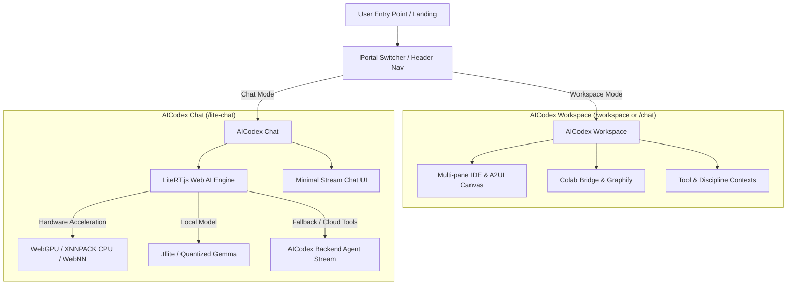

# Implementation Plan - AICodex Portals: AICodex Workspace & AICodex Chat (LiteRT.js)

Classify the existing full-featured client interface as **AICodex Workspace** and design/implement a second lightweight, chat-focused portal named **AICodex Chat** powered by Google's **LiteRT.js** (`@litertjs/core` and `LiteRT-LM.js`) for local on-device Web AI inference with hybrid backend fallback.

---

## Architecture Overview

---

## Key Features & Design Intent

1. **Portal Classification & Branding**:
   - **AICodex Workspace**: Renames/classifies current robust, component-heavy client UI (`/chat` or `/workspace`) with A2UI canvas, multi-pane sidebar, tools, and discipline engines.
   - **AICodex Chat**: Lean, high-speed, minimalist portal (`/lite-chat`) optimized purely for conversational interactions.

2. **LiteRT.js Local Web AI Engine (`src/services/liteRtService.ts`)**:
   - Integrates `@litertjs/core` to run `.tflite` models directly inside the browser using WebGPU / XNNPACK / WebNN.
   - Detects client hardware acceleration capabilities dynamically.
   - Streams local inference output instantly with zero server latency and zero API cost.
   - Manages local model caching (IndexedDB/CacheStorage) for fast subsequent loads.

3. **Hybrid Dual-Engine Processing**:
   - Local mode handles quick Q&A, formatting, prompt crafting, and text transformations locally via LiteRT.js.
   - Hybrid mode auto-routes complex agent queries requiring cloud tools, sandboxing, or RAG to the existing AICodex backend API.

4. **UI/UX Aesthetics & Navigation**:
   - Top-level **Portal Switcher** badge/tab in header allowing 1-click toggling between Workspace and Chat.
   - Dynamic hardware status pill (e.g., `⚡ LiteRT WebGPU (Local)` vs `☁️ AICodex Cloud`).
   - Clean micro-animations, glassmorphism card styling, responsive prompt bar, and live token throughput metrics (tokens/sec).

---

## User Review Required

> [!IMPORTANT]
> - **Default Model Allocation for LiteRT.js**: Should we auto-download a lightweight default model (e.g. 1.5B–2B quantized `.tflite` / EmbeddingGemma) on user consent, or provide a model manager UI within AICodex Chat to let users select local `.tflite` models?
> - **URL Path Classification**: Should `/chat` remain pointing to the Workspace (with an alias `/workspace`), while `/lite-chat` handles LiteRT Chat?

---

## Open Questions

> [!NOTE]
> 1. Do you have a preferred local `.tflite` model source (e.g., HuggingFace LiteRT collection / Kaggle Models) for the browser inference engine?
> 2. Should local chat history in **AICodex Chat** automatically sync with the **AICodex Workspace** session database?

---

## Proposed Changes

### Client Package (`client/`)

#### [MODIFY] [package.json](file:///c:/AppDev/My_Linkdin/projects/iarxii/AI_Codex/client/package.json)
- Add `@litertjs/core` (and `@litertjs/lm` if applicable) to dependencies.

---

### Portal & Routing (`client/src/`)

#### [MODIFY] [App.tsx](file:///c:/AppDev/My_Linkdin/projects/iarxii/AI_Codex/client/src/App.tsx)
- Add `/lite-chat` route for **AICodex Chat**.
- Register `/workspace` route pointing to current workspace chat implementation.

#### [NEW] [PortalSwitcher.tsx](file:///c:/AppDev/My_Linkdin/projects/iarxii/AI_Codex/client/src/components/layout/PortalSwitcher.tsx)
- Compact toggle UI in navigation bar allowing users to switch between **AICodex Workspace** and **AICodex Chat**.

#### [NEW] [LiteChat.tsx](file:///c:/AppDev/My_Linkdin/projects/iarxii/AI_Codex/client/src/pages/LiteChat.tsx)
- Dedicated lightweight chat page for **AICodex Chat**.
- Clean, focused chat view with input area, message list, streaming animation, hardware engine status indicator, and model engine selector.

---

### LiteRT.js Service Integration (`client/src/services/`)

#### [NEW] [liteRtService.ts](file:///c:/AppDev/My_Linkdin/projects/iarxii/AI_Codex/client/src/services/liteRtService.ts)
- Wrapper around `@litertjs/core`.
- Capabilities: `initLiteRt()`, `detectAccelerator()` (WebGPU, CPU/XNNPACK, WebNN), `loadModel(modelPath)`, `runInference(prompt, options)`, `unloadModel()`.

#### [NEW] [useLiteRtChat.ts](file:///c:/AppDev/My_Linkdin/projects/iarxii/AI_Codex/client/src/hooks/useLiteRtChat.ts)
- Custom React hook managing local model lifecycle, prompt streaming, fallback triggers, and performance metrics (TPS, memory, accelerator type).

---

### Workspace UI Rebranding

#### [MODIFY] [Sidebar.tsx](file:///c:/AppDev/My_Linkdin/projects/iarxii/AI_Codex/client/src/components/Sidebar.tsx) & [Header UI]
- Add "AICodex Workspace" classification header badge.

---

## Verification Plan

### Automated & Unit Tests
- Build verification via `npm run build` in `client/`.
- Verify TypeScript types for `@litertjs/core` integration.

### Manual Verification
- Launch local Vite dev server (`npm run dev`).
- Test switching between **AICodex Workspace** (`/workspace` or `/chat`) and **AICodex Chat** (`/lite-chat`).
- Test LiteRT.js hardware accelerator detection (WebGPU vs WASM fallback).
- Verify streaming inference and hybrid fallback to backend agent.
