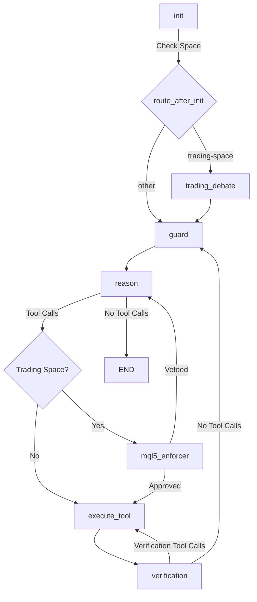

# Architecture Review & Recommendations: Agent Loop Evolution & Context Management

This document reviews the proposed agent loop architecture, user-interface enhancements, and context management protocols described in:
* [Agent_Loop_Evaluation_20260705.md](file:///c:/AppDev/My_Linkdin/projects/iarxii/AI_Codex/docs/research/Agent_Loop_Evaluation_20260705.md)
* [Context_Managemen_Token_Use_20260705.md](file:///c:/AppDev/My_Linkdin/projects/iarxii/AI_Codex/docs/research/Context_Managemen_Token_Use_20260705.md)

It compares these proposals against the **As-Is architecture** of the `AI_Codex` and `CodexSpaces` platforms, identifies architectural gaps, and provides concrete recommendations for implementation.

---

## 1. Executive Summary

The proposed architecture aims to transition the AI Codex agent from a simple request-response mechanism to a robust, self-correcting, and self-managing long-horizon agentic system. This is achieved by introducing:
1. **A State-Driven ReAct Loop**: An evaluation node acts as a quality gate to verify task outcomes before exiting.
2. **Autonomous Memory Compaction**: The agent can choose to execute a compaction tool to summarize old message history and optimize the token budget.
3. **Double-Threshold Token Stops**: Track cumulative rolling tokens across the session using a **Minimum Token Stop (Warning Alert)** and a **Maximum Token Stop (Hard Cap Alert)**.
4. **Writeable Scratchpad Plan**: An un-compactable state field and a tool (`write_scratchpad`) enabling the agent to write, update, and persist a structured checklist of tasks throughout the execution loop.
5. **Visual Developer Telemetry**: A new **Context Window Panel** in the VS Code sidebar Webview provides real-time visualization of memory usage, token velocity, and compaction events.

### ⚠️ Coexistence of SDK Stacks (Clarification)
Following system review, we clarify that:
* **Gemma-Code-Lab Exclusively**: Uses the linear **Google ADK 2.0 and native Google GenAI SDK** pipeline (non-cyclic planning & execution).
* **AI_Codex Parent Agent**: Continues to run on the **LangGraph / LangChain** ecosystem (cyclic ReAct loop & tool execution). There is no global deprecation of the LangStack; both ecosystems run side-by-side in their respective application boundaries.

---

## 2. As-Is Architecture Analysis

### A. Graph Topology & Routing (`AI_Codex/backend/agent/graph.py`)
The current LangGraph agent is defined as follows:



* **Early Exit**: The graph terminates (`END`) immediately when the `reason` node returns no tool calls. There is no checkpoint to verify whether the files were correctly modified or if all sub-tasks in a multi-phase request were completed.
* **Bypassed Validator**: The `validate` node (designed to catch fabrication where the agent claims file operations occurred without calling tools) is currently bypassed in `should_continue` routing logic.
* **Verification Node**: It checks if files were written and triggers a compiler/linter check (e.g. `npm run compile` or `python -m py_compile`) via a nested `shell_exec` tool call. If errors are found, it injects a verification failure message back into the history.

### B. Passive Memory Summarization (`nodes.py` L626-L653)
Currently, `reason_node` contains a helper called `summarize_history`. If the conversation history exceeds a certain token threshold, it performs a backend-forced truncation and summarization of old messages. The agent has no active awareness or control over this process.

### C. Client-Injected Scratchpad (`state.py` L37)
The As-Is state exposes a `scratchpad` field, but it is **read-only** and populated before execution (carrying local search RAG chunks). The agent has no mechanism to update this state or store detailed plans and checklists.

---

## 3. Comparative Gap Analysis

| Feature | Proposed ReAct & Memory Architecture | Current As-Is Architecture | Gap Severity & Impact |
| :--- | :--- | :--- | :--- |
| **Termination Decision** | **State-Driven**: Evaluator node inspects `execution_artifacts` and compares them to `task_goal`. Declares incomplete if goal is not met. | **Output-Driven**: Terminated by the LLM deciding to output message text without tool calls. | **High**: Agent exits prematurely after finishing a subset of steps, thinking the whole task is done. |
| **Self-Correction & Sequencing** | **Self-Command Injection**: Injects specific instruction and critique back to message history to trigger the next phase. | **Passive**: Relies on linter errors returned by the `verification` node. Cannot auto-sequence phase 2 after phase 1. | **High**: Long-horizon multi-step tasks cannot be completed without user manual prompt intervention. |
| **Synthesis Layer** | **Synthesis Node**: Synthesizes the execution history into a clean summary and strategic recommendations. | **None**: The final response is whatever text the model emitted in its last turn. | **Medium**: The output can be cluttered with intermediate tool calls and lack clear "next steps". |
| **Context Compaction Control** | **Autonomous Tool Call**: Agent explicitly calls `compact_context` when it detects high token load or transition points. | **Passive Truncation**: Truncates history automatically based on token budget thresholds. | **Medium**: The model is unaware of compression and may lose critical early context. |
| **Writeable Task Scratchpad** | **Planning Board**: Tool `write_scratchpad` allows the agent to update and persist its active plan/checklist in a dedicated un-compactable field. | **None**: The `scratchpad` is read-only and limited to client-injected semantic search chunks. | **High**: Plan details are lost during context compaction, leading to loss of direction. |
| **Stagnation Control** | **Stagnation Router**: Logs a fingerprint of the last 3 actions. Breaks loop on stagnation to request user intervention. | **Simple Guard**: `guard_node` checks if the same tool with the same arguments was called 3 times *consecutively* within the turn. | **Medium**: Repetitive loops over different arguments or oscillating actions are not detected. |
| **Token Stop Enforcement** | **Double-Threshold Stops**: Native warning (`vscodex.token.warningStop`) & hard cap (`vscodex.token.maxStop`) via BYOK configs. | **Fixed Budgets**: Relies on LangGraph's default recursion limit (100) or token budget truncations. | **High**: Runaway loops can silently consume huge token budgets on user API keys. |
| **Visual Telemetry** | **VS Code Context Panel**: Rich webview displaying category allocations, token velocity, and compaction logs. | **None**: Telemetry is collected in `state["telemetry"]` but only outputted as raw WebSocket JSON messages. | **Medium**: The memory usage and cost profiling are invisible to the end user. |

---

## 4. Implementation Recommendations

To evolve the agent loop and context management without introducing breaking changes, we recommend the following phased integration plan.

### Phase 1: Update the Graph State (`state.py`)
Add support for tracking the task list, execution progress, action fingerprints, and token metrics.

```diff
# c/AppDev/My_Linkdin/projects/iarxii/AI_Codex/backend/agent/state.py
class AgentState(TypedDict):
     messages: Annotated[List[BaseMessage], add_messages]
     current_tool_calls: List[dict]
     context_data: dict
     routing_decision: dict
     is_complete: bool
     error: Optional[str]
     telemetry: dict
     space_config: dict
     trading_context: Optional[dict]
-    # Client-injected workspace data and semantic context
-    scratchpad: Optional[dict]
+    # --- Extended ReAct Loop State ---
+    task_goal: str                         # The ultimate objective
+    execution_artifacts: Dict[str, Any]    # Records of changes (e.g. modified files)
+    evaluation_report: Dict[str, Any]      # Results from evaluate_turn node
+    recent_actions_fingerprint: List[str]  # History of tool calls for stagnation detection
+    # --- Token Allocation Metrics ---
+    token_metrics: Dict[str, int]          # {system, summary, tail, total, max}
+    # --- Self-Correction & Quality Tracking ---
+    quality_history: List[float]           # Rolling log of quality scores (0.0 - 1.0)
+    consideration_vector: Dict[str, Any]   # Directives for reasoning constraint
+    # --- Writeable Scratchpad & Planning ---
+    scratchpad: Optional[dict]             # Contains: {"retrieved_chunks": [...], "task_plan": "..."}
```

---

### Phase 2: Implement the Evaluation & Synthesis Nodes (`nodes.py`)
We introduce `evaluate_turn_node` and `final_report_node` in the backend.

```python
# c/AppDev/My_Linkdin/projects/iarxii/AI_Codex/backend/agent/nodes.py

async def evaluate_turn_node(state: AgentState, config: RunnableConfig) -> Dict[str, Any]:
    """
    Evaluator Node (Quality Gate).
    Compares the updated execution artifacts and messages against the user's task_goal.
    Determines if the goal has been achieved, computes a quality score, and updates
    the consideration vector to steer the agent away from destructive behaviors.
    """
    messages = state["messages"]
    goal = state.get("task_goal") or (messages[0].content if messages else "")
    artifacts = state.get("execution_artifacts") or {}
    last_action = messages[-1].content if messages else ""
    
    lines_added = artifacts.get("lines_added", 0)
    lines_deleted = artifacts.get("lines_deleted", 0)
    
    llm = await get_dynamic_llm(config, bind_tools=False, tier="validation")
    
    eval_prompt = f"""
    You are the Autonomous Quality Gate for AICodex.
    Analyze the recent work against the Ultimate Goal.
    
    Ultimate Goal: {goal}
    Current Artifacts (Modified Files/State): {artifacts}
    Code Changes: Added {lines_added} lines, Deleted {lines_deleted} lines.
    Last Agent Message: {last_action}
    
    Verify:
    1. Did the code compile or pass tests successfully?
    2. Are modifications constructive or destructive?
    
    Respond in JSON format with keys:
    {{
        "goal_achieved": true | false,
        "quality_score": 0.0 to 1.0,
        "critique": "Analysis of what is missing or if errors remain",
        "next_instruction": "Command or directive the agent must give itself to continue",
        "consideration_vector": {{
            "priority": "ADDITION_PREFERRED" | "REFACTOR" | "BUG_FIX",
            "anti_pattern_guard": "Instructions on what to avoid, e.g., 'Do not delete the module router to fix imports'",
            "focus_area": "Target file or error block to repair"
        }}
    }}
    """
    
    response = await llm.ainvoke([HumanMessage(content=eval_prompt)])
    
    import json
    try:
        cleaned_content = response.content.strip().strip("```json").strip("```").strip()
        eval_report = json.loads(cleaned_content)
    except Exception:
        eval_report = {
            "goal_achieved": True,
            "quality_score": 1.0,
            "critique": "Failed to parse evaluator response. Assuming complete.",
            "next_instruction": "",
            "consideration_vector": {"priority": "BUG_FIX", "anti_pattern_guard": "", "focus_area": ""}
        }
        
    quality_history = state.get("quality_history", []) + [eval_report.get("quality_score", 1.0)]
        
    return {
        "evaluation_report": eval_report,
        "quality_history": quality_history,
        "consideration_vector": eval_report.get("consideration_vector", {})
    }


async def final_report_node(state: AgentState, config: RunnableConfig) -> Dict[str, Any]:
    """
    Synthesis Node.
    Summarizes the agent's work and outputs actionable next steps/recommendations.
    """
    messages = state["messages"]
    goal = state.get("task_goal") or ""
    
    internal_trail = []
    for msg in messages:
        if isinstance(msg, AIMessage) and msg.content:
            internal_trail.append(f"- Agent: {msg.content[:200]}...")
        elif isinstance(msg, ToolMessage):
            internal_trail.append(f"- Tool executed ({msg.name}): {str(msg.content)[:100]}")
            
    trail_str = "\n".join(internal_trail)
    llm = await get_dynamic_llm(config, bind_tools=False, tier="reasoning")
    
    summary_prompt = f"""
    You are the Final Synthesis layer of AICodex. 
    The agent has successfully completed the user's task. Summarize the process and provide concrete next steps.
    
    Ultimate Goal: {goal}
    Execution Trail:
    {trail_str}
    
    Format your response in Markdown:
    ### 📋 Execution Post-Mortem
    * [Concise breakdown of what was achieved]
    
    ### 🚀 Recommended Next Steps
    * [2-3 concrete actions the user can take now, e.g. tests to run, code reviews, deployment]
    """
    
    response = await llm.ainvoke([HumanMessage(content=summary_prompt)])
    return {"messages": [AIMessage(content=response.content)]}
```

---

## 5. Degradation & Runaway Deletion Guard

To prevent the agent from degrading into loop cycles where it recursively deletes code blocks to satisfy syntax errors (a common regression behavior), we integrate the following logic:

### 1. Loop Degradation Check
In the conditional router (`route_after_evaluation`), we monitor the `quality_history`:
* If the last 3 quality scores show a downward trajectory (e.g. `[0.8, 0.5, 0.3]`), or if `lines_deleted` significantly outweighs `lines_added` without satisfying the goal, we route to `handle_blocker` instead of resuming the loop.
* The `handle_blocker` node suspends the run, exposes the diagnostic log, and prompts the user for intervention.

### 2. Injecting the Consideration Vector
When looping back to the reasoning node, the system prompt builder in `reason_node` injects the active `consideration_vector` as an un-evictable system prompt addition:

> **System Prompt Injection**:
> `[SYSTEM RULE: You are entering turn X. Based on evaluation of your last action, you must adhere to the following Consideration Vector to prevent degradation:`
> ` - Focus Area: {focus_area}`
> ` - Preferred Strategy: {priority}`
> ` - Anti-Pattern Guardrail: {anti_pattern_guard} (Violating this will result in immediate compilation rejection)]`

---

## 6. Writeable Planning Scratchpad (`tools.py`)
To prevent plan details from being lost during memory compaction, we add a writeable `task_plan` under `state["scratchpad"]`. The plan remains 100% un-evictable because it is separated from the raw message list history.

```python
# c/AppDev/My_Linkdin/projects/iarxii/AI_Codex/backend/agent/tools.py

from langchain_core.tools import StructuredTool

async def write_scratchpad(plan_markdown: str, state: AgentState) -> str:
    """
    Allows the agent to write, append, or update its detailed task checklist and engineering plan.
    Use this to keep track of sub-tasks across complex execution loops.
    """
    scratchpad = state.get("scratchpad") or {}
    scratchpad["task_plan"] = plan_markdown
    state["scratchpad"] = scratchpad
    return "Scratchpad planning board updated successfully."

write_scratchpad_tool = StructuredTool.from_function(
    coroutine=write_scratchpad,
    name="write_scratchpad",
    description="Update the persistent, un-compactable checklist and execution plan."
)
```

In `reason_node` system prompt compiler:
```python
# System prompt compiler adds:
plan = state.get("scratchpad", {}).get("task_plan", "")
if plan:
    system_prompt += f"\n\n[ACTIVE TASKS SCRATCHPAD BOARD]\n{plan}\n"
```

---

## 7. Implement Python `compact_context` Tool (`tools.py`)

```python
# c/AppDev/My_Linkdin/projects/iarxii/AI_Codex/backend/agent/tools.py

from langchain_core.tools import StructuredTool
from langchain_core.messages import SystemMessage, AIMessage, HumanMessage

async def compact_context(force_reason: str, state: AgentState, config: RunnableConfig) -> str:
    """
    Enables the agent to clear short-term memory by compressing historical multi-turn chat records,
    logs, and tool outputs into a high-density summary.
    """
    messages = state.get("messages", [])
    if not messages:
        return "No history available to compact."
        
    system_instructions = [m for m in messages if isinstance(m, SystemMessage)]
    active_tail = messages[-4:]
    intermediate_history = messages[len(system_instructions):-4]
    
    if len(intermediate_history) < 3:
        return "History tail is too short. Compaction skipped."
        
    # Summarize intermediate history
    llm = await get_dynamic_llm(config, bind_tools=False, tier="validation")
    summary_prompt = (
        "Condense the following tool traces, command outputs, and assistant reasoning turns "
        "into a high-density chronological bullet-point summary of what was done, what issues were resolved, "
        "and what files were changed. Do not omit any file paths or compiler errors.\n\n"
        f"History to condense:\n{str(intermediate_history)}"
    )
    
    summary_res = await llm.ainvoke([HumanMessage(content=summary_prompt)])
    summary_text = summary_res.content
    
    new_messages = system_instructions + [
        SystemMessage(content=f"[CONTEXT COMPACTED] Summary of preceding work:\n{summary_text}")
    ] + active_tail
    
    old_size = sum(len(str(m.content)) for m in intermediate_history)
    new_size = len(summary_text)
    saved_chars = max(0, old_size - new_size)
    
    state["messages"] = new_messages
    return f"Success: Compacted memory. Saved approximately {saved_chars // 4} tokens."

compact_context_tool = StructuredTool.from_function(
    coroutine=compact_context,
    name="compact_context",
    description="Compress old history and tool execution logs to free up token budget."
)
```

---

## 8. Configure VS Code Webview Panel & Settings (`package.json` & extension)

To add the **Context Window Panel** and register settings for BYOK token stops:

#### 1. Register View and Settings in `package.json`
Add the view under `views` -> `spirit-bird-sidebar` and the settings properties under `configuration`:

```json
"views": {
  "spirit-bird-sidebar": [
    {
      "type": "webview",
      "id": "spirit-bird-chat-view",
      "name": "VSCodex by AdaptivConceptFL™"
    },
    {
      "type": "webview",
      "id": "spirit-bird-context-window",
      "name": "Context Window Panel"
    },
    {
      "type": "tree",
      "id": "spirit-bird-solution-explorer",
      "name": "Solution Explorer"
    }
  ]
},
"configuration": {
  "title": "Spirit Bird - CodexSpaces",
  "properties": {
    "vscodex.token.warningStop": {
      "type": "number",
      "default": 250000,
      "description": "Minimum Token Stop: Triggers a soft warning alert banner with context compaction recommendations when session usage crosses this value."
    },
    "vscodex.token.maxStop": {
      "type": "number",
      "default": 1000000,
      "description": "Maximum Token Stop: Hard rate limit ceiling. Halts agent loops and prompts for manual verification to prevent runaway BYOK billing spikes."
    }
  }
}
```

#### 2. Implement provider class `ContextWindowPanelProvider.ts` in extension
Mount the class using `vscode.WebviewViewProvider` and wire it in the extension registration:

```typescript
// vscode-extension/src/views/ContextWindowPanelProvider.ts
import * as vscode from 'vscode';

export class ContextWindowPanelProvider implements vscode.WebviewViewProvider {
    public static readonly viewType = 'spirit-bird-context-window';
    private _view?: vscode.WebviewView;

    constructor(private readonly _extensionUri: vscode.Uri) {}

    public resolveWebviewView(
        webviewView: vscode.WebviewView,
        context: vscode.WebviewViewResolveContext,
        _token: vscode.CancellationToken
    ) {
        this._view = webviewView;
        webviewView.webview.options = {
            enableScripts: true,
            localResourceRoots: [this._extensionUri]
        };
        webviewView.webview.html = this._getHtmlForWebview(webviewView.webview);
    }

    public updateTelemetryDashboard(telemetryData: any) {
        if (!this._view) return;
        this._view.webview.postMessage({
            command: 'updateMetrics',
            data: telemetryData
        });
    }

    private _getHtmlForWebview(webview: vscode.Webview): string {
        return `...`;
    }
}
```

#### 3. Push Telemetry through `/ws/agent` WebSocket (`api/chat.py`)
In the graph execution loop, calculate token sizes for categories: System, Summary, Tail, and Free. Emit a new telemetry message type `type: "context_telemetry"` to the client, which forwards the data directly to the webview view provider using `updateTelemetryDashboard()`.

---

## 9. Token Stop Tracking Flow

The double-threshold tracking system operates on an active loop wrapped around the API call lifecycle:

1. **Context Interception & Pre-flight Count**: Before sending the query to the server, the extension performs a local token estimation of the prompt + active files using a local tokenizer (`tiktoken`).
2. **Threshold Evaluation**: Add the estimated tokens to the session's cumulative total.
   - If total > `vscodex.token.warningStop`, fire a soft **VS Code Information Message** warning the user and suggesting context compaction.
   - If total > `vscodex.token.maxStop`, immediately halt execution *before* calling the cloud LLM, showing a locked chat panel with details of the budget overrun.
3. **Response Verification**: On response received, parse headers (e.g. `x-ratelimit-remaining-tokens` or `usage.total_tokens`) to sync the local estimation with actual server counts, resolving the exact amount of reasoning/thinking tokens consumed.
4. **Emergency UI Recovery**: If the hard limit is tripped, render the two options:
   - **"Override and Add 500k Tokens"**: Temporarily increase the session limit for this conversation instance.
   - **"Open Extension Settings"**: Trigger the settings dashboard to update defaults.

---

## 10. Summary of Benefits & Trade-Offs

### Benefits
1. **Billing Safety**: Prevents runaway billing spikes on BYOK developer API keys.
2. **Context Longevity**: The agent autonomously clears space for new edits without losing the system prompt's instructions.
3. **Persistent Focus**: The writeable scratchpad preserves the agent's step-by-step checklist across token summaries.
4. **High Transparency**: Real-time tracking displays usage breakdowns (Prompt vs. Reasoning vs. Generation) directly inside the sidebar.
5. **Resilience**: Prevents degrading/destructive cycles where the agent deletes code to satisfy a single lint check.

### Trade-offs & Risks
1. **Local Tokenizer Overhead**: Running local estimations in the extension requires importing libraries like `tiktoken`. We can optimize this by performing rough length-based estimations or using lightweight node bindings.
2. **Summarization Latency**: Executing `compact_context` triggers an extra LLM call. However, since the agent chooses *when* to execute it, this delay is only introduced at transition points or when token limits are close.
