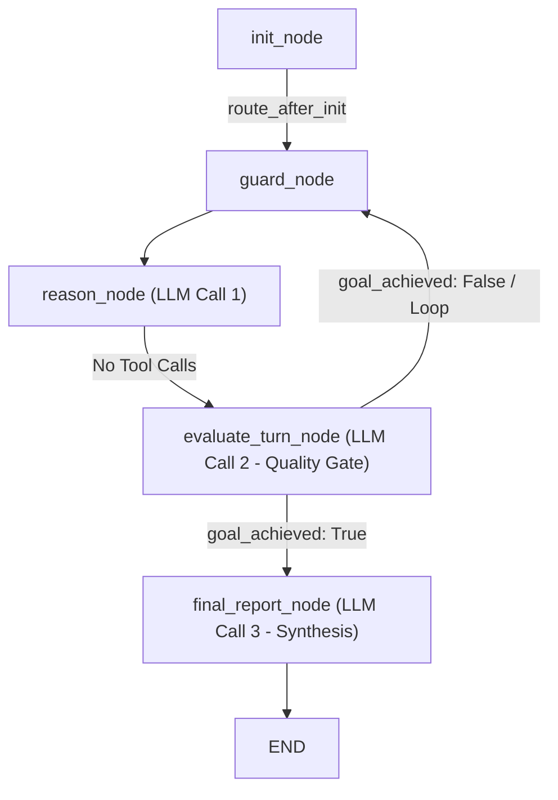
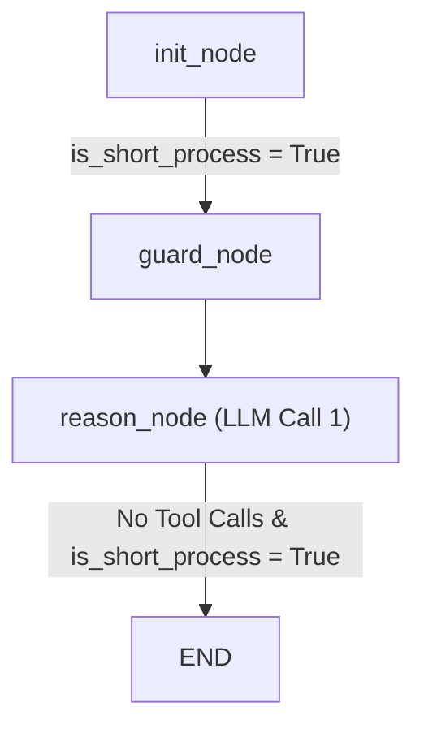
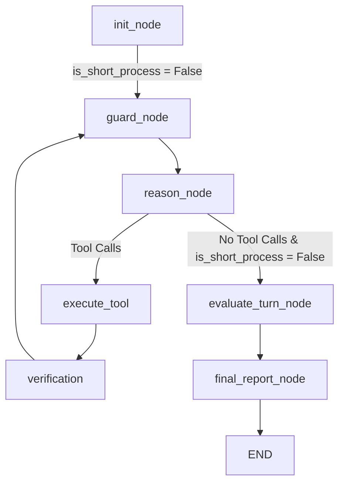

# Review & Recommendations: Short-Process vs. Long-Process Agent Routing

This document reviews the current behavior of the `AI_Codex` backend graph execution loop, identifies why simple queries (e.g., greetings like "Hi" or general questions) trigger slow, expensive, and potentially infinite process loops, and proposes a self-healing way forward to bypass unnecessary nodes.

---

## 1. As-Is Behavior & Diagnostics

When a user submits a query to the `AI_Codex` agent, the execution graph follows this path:



### The Core Problem

1. **Unnecessary Quality Gates for Simple Prompts**:
   If the user query is a simple greeting ("Hi") or an informational question ("What is python?"), the agent generates no tool calls. Consequently, `should_continue` routes the graph to `evaluate_turn_node`.
2. **Quality Gate Failure on Conversational Inputs**:
   `evaluate_turn_node` asks an LLM to evaluate the work against the "task goal" in terms of code changes (compilation status, additions vs. deletions). Since a conversational query makes no code changes, the evaluator LLM may return `"goal_achieved": false`, causing the agent to loop back to `guard` -> `reason` -> `evaluate_turn` infinitely.
3. **Multi-LLM Call Penalty**:
   Even if the evaluator decides `"goal_achieved": true`, the agent transitions to `final_report_node`, executing a third LLM invocation to summarize the "execution post-mortem" and suggest recommended next steps. This is slow, wasteful, and feels unresponsive.

---

## 2. Proposed Way Forward: Dynamic Short-Process Routing

We can introduce a **Short-Process** path that routes conversational and tool-less queries directly to the `END` node after the initial reasoning turn.

### Key Architecture Components

1. **State Extension**:
   Add `is_short_process` (boolean) to `AgentState` to store whether the current run represents a short process.

2. **Heuristic Classification in `init_node`**:
   Before invoking any models, `init_node` analyzes the user's query:
   - Check if the text matches a set of greetings ("hi", "hello", "hey", "good morning") or simple conversational inputs ("thanks", "thank you", "ok", "yes", "no").
   - Perform length and keyword checks (e.g., inputs `< 40` characters that do not contain action keywords like "create", "write", "run", "git" or file extensions like `.py`, `.ts`, `.json`).
   - If it meets these criteria, mark `is_short_process = True`.

3. **Dynamic Promotion Safeguard (Safety Valve)**:
   If `is_short_process` is set to `True`, but the LLM in `reason_node` generates `tool_calls` (meaning it actually wants to perform an action), we dynamically override it: `is_short_process = False`.

4. **Optimized Routing in `should_continue`**:
   We update `should_continue` to inspect the `is_short_process` flag when no tool calls are generated:
   - If `has_calls` is `True` -> Route to `execute_tool` (and promote to long process).
   - If `has_calls` is `False`:
     - If `is_short_process` is `True` -> Route directly to `END` (Only **1 LLM call**!).
     - If `is_short_process` is `False` -> Route to `evaluate_turn` (Long process validation).

### New Graph Flow Comparison

#### Short-Process Flow (Greetings/Simple Chats):


#### Long-Process Flow (Code Edits/Complex Queries):


---

## 3. Implementation Steps

### 1. Update `state.py`
Add `is_short_process: Optional[bool]` to `AgentState`.

### 2. Update `nodes.py`
Modify `init_node` to evaluate the user's latest message and set `is_short_process`.

```python
async def init_node(state: AgentState, config: RunnableConfig) -> Dict[str, Any]:
    # ... existing telemetry setup ...
    
    # Heuristic Classification for Short Process
    messages = state.get("messages", [])
    is_short = False
    if messages:
        last_msg = messages[-1]
        if hasattr(last_msg, "content") and isinstance(last_msg.content, str):
            content = last_msg.content.strip().lower()
            
            # Common greetings & gratitude
            greetings = {"hi", "hello", "hey", "yo", "greetings", "good morning", "good afternoon", "good evening", "howdy"}
            gratitude = {"thanks", "thank you", "thanks!", "thank you!", "ok", "okay", "yes", "no", "bye", "goodbye"}
            
            if content in greetings or content in gratitude:
                is_short = True
            elif len(content) < 45:
                # Short query: check for absence of commands, extensions, or path symbols
                action_words = {"write", "create", "delete", "run", "make", "git", "diff", "search", "find", "build", "compile", "test", "add"}
                file_exts = {".py", ".js", ".ts", ".html", ".css", ".json", ".md", ".sh", ".bat"}
                
                has_action = any(word in content for word in action_words)
                has_ext = any(ext in content for ext in file_exts)
                has_path = "/" in content or "\\" in content
                
                if not (has_action or has_ext or has_path):
                    is_short = True
                    
    return {"telemetry": telemetry, "is_short_process": is_short}
```

### 3. Update `graph.py`
Update `should_continue` to support short-circuiting:

```python
def should_continue(state: AgentState):
    last_message = state["messages"][-1]
    has_calls = hasattr(last_message, "tool_calls") and last_message.tool_calls
    
    # Dynamic Promotion Safeguard
    is_short = state.get("is_short_process", False)
    
    if has_calls:
        # If it has tool calls, it MUST run in long-process mode
        state["is_short_process"] = False
        slug = state.get("space_config", {}).get("slug", "")
        if slug == "trading-space":
            return "mql5_enforcer"
        return "execute_tool"
        
    # If no tool calls and it's a short process, we end immediately
    if is_short:
        return END
        
    return "evaluate_turn"
```

And update `create_agent_graph` edges to register `END` under `should_continue` conditional outputs:

```python
    workflow.add_conditional_edges(
        "reason",
        should_continue,
        {
            "mql5_enforcer": "mql5_enforcer",
            "execute_tool": "execute_tool",
            "evaluate_turn": "evaluate_turn",
            END: END
        }
    )
```

## 4. Google ADK Stack UI Branding

To differentiate the stateless Gemma Code Lab agent from the cyclic LangGraph-based parent agent:
- We will modify the rendering utility `a2ui_renderer.py` inside the `CodexSpaces` backend.
- Append a `"Google ADK Stack"` metadata badge component within `render_code_lab_output()` so that all A2UI output cards render this tag prominently in the extension webview UI:
  ```python
      badges: list[dict] = [
          a2ui_badge(output.language.upper(), variant="primary"),
          a2ui_badge(f"⚡ {output.model_used}", variant="secondary"),
          a2ui_badge("Google ADK Stack", variant="success"),
      ]
  ```
- Modify the web-client HUD component `GemmaSandboxHarness.tsx` in `AI_Codex/client` to render the `"Google ADK Stack"` badge inline next to the `"Gemma Code Lab"` title in the header card.

---

## 5. Verification Plan

1. **Conversational Test**: 
   Ask the agent "Hi" or "Thanks". Confirm it executes exactly 2 nodes (`init` -> `guard` -> `reason`) and exits immediately with `END`.
2. **Tool Execution Test**: 
   Ask the agent to modify a file. Confirm that because it generates `tool_calls`, it gets dynamically promoted to `is_short_process = False`, executes the tools, evaluates the turn, and completes via `final_report`.
3. **ADK Stack Extension UI Branding Test**:
   Request a Code Lab generation. Check that the output card renders a green `"Google ADK Stack"` badge next to the model and language badges.
4. **Web Client Sandbox Badge Test**:
   Open the web client and navigate to the Gemma Code Lab space. Verify that the header card inside the sandbox panel renders the `"Google ADK Stack"` badge next to the `"Gemma Code Lab"` title.
